# BABY HEALTH APPLICATION — MEDICAL AND PRODUCT SPECIFICATION

| Field | Value |
|---|---|
| Document | BABY_HEALTH_APPLICATION_MEDICAL_AND_PRODUCT_SPECIFICATION.md |
| Version | 1.0.0 (pre-implementation baseline) |
| Status | DRAFT — internally reviewed; **requires pediatrician, privacy-counsel and security review before build sign-off** |
| Research / verification date | 2026-10-06 (Asia/Kolkata) |
| Companion files | `medical_reference_data.json` (structured references with provenance), `openapi.yaml` (API contract), `cradle-calm-design-board.png` + `cradle-calm-philosophy.md` (visual direction) |
| Product owner | Pratham |
| Country focus | India |

> **Reading rule for everyone using this document.** Nothing in this document is medical advice. Every medical number has a provenance record and a *verification status*. A number whose status is not `CLEARED` must not reach a parent's screen. If you cannot find a number here, that is deliberate: write `NOT_ESTABLISHED` and do not invent one.

### Verification status legend (used throughout)

| Status | Meaning | May ship? |
|---|---|---|
| `VERIFIED_IN_SESSION` | Primary source was opened on 2026-10-06 and the statement was located (via an automated reader). | Only after a human re-checks the exact wording/page (release gate `HUMAN_RECHECK_REQUIRED`). |
| `USER_SUPPLIED_PENDING` | Value came from the product brief; the primary source **could not be opened** in this session. | **No.** Release gate `BLOCKED_UNTIL_PRIMARY_SOURCE_VERIFIED`. |
| `METADATA_ONLY` | Title/date/ISBN confirmed; recommendation text not read. | No (for content). |
| `CORROBORATION_ONLY` | Used only to detect conflicts between versions. Never establishes a value. | n/a |
| `NOT_ESTABLISHED` / `NO_AUTHORITATIVE_UNIVERSAL_VALUE_FOUND` | No authoritative value applies. This is valid, displayable information. | Yes (as an absence statement). |

### Source-access log for this research session (transparency)

| Source | Result on 2026-10-06 | Consequence |
|---|---|---|
| NHM — KMC & Optimal Feeding of LBW Infants (nhm.gov.in) | Fetch failed (robots.txt fetch failure / timeout). Not retrieved by any alternative route. | All NHM LBW numbers = `USER_SUPPLIED_PENDING`. |
| IAP — Ch-039 Breastfeeding (iapindia.org) | Refused: disallowed by robots.txt. | All IAP breastfeeding numbers = `USER_SUPPLIED_PENDING`. |
| WHO/HEP/NFS/21.41 PDF (iris.who.int) | HTTP 403. Landing page opened: it is *IYCF counselling: an integrated course — course handouts*, 15 Oct 2021, 179 pp. | Feeding volumes = `USER_SUPPLIED_PENDING`; note it is training material, not a guideline. |
| MoHFW "Universal Immunization Programme.pdf" (brief's URL) | HTTP 404. | Replaced by MoHFW "National Immunization Schedule.pdf" (opened). |
| MoHFW National Immunization Schedule PDF | Opened. | `VERIFIED_IN_SESSION` (undated; partly superseded). |
| MoHFW/RISE — fIPV 3rd dose FAQ | Opened. | `VERIFIED_IN_SESSION`. |
| WHO IYCF fact sheet (dated 4 Aug 2026) | Opened. | `VERIFIED_IN_SESSION`. |
| WHO Complementary Feeding Guideline 2023 | Landing page only. | `METADATA_ONLY`. |
| WHO Child Growth Standards + indicator pages | Opened; dataset URLs captured. Binary .xlsx files could not be downloaded from the research environment. | Datasets to be imported at build time (no values embedded). |
| WHO 2022 Preterm/LBW recommendations (NCBI Bookshelf Table 1) | Opened. | `VERIFIED_IN_SESSION`. |
| IAP ACVIP 2023 schedule (Indian Pediatrics e-pub, Jan 2024) | Opened. | `VERIFIED_IN_SESSION` but **superseded**. |
| IAP ACVIP 2025 schedule (Springer) | HTTP 429 (rate limited); PubMed CAPTCHA. | Existence confirmed only. IAP schedule blocked until verified. |
| IAP Guidebook on Immunization (iapindia.org) | Not fetchable (robots.txt). | Not used. |
| DPDP Rules 2025 (MeitY Gazette G.S.R. 846(E)) and commencement notification G.S.R. 843(E) | Opened. | Used in the Privacy section; legal conclusions flagged for counsel. |

---

## 1. Executive Summary

The application is an India-focused, mobile-first, multi-baby health record. It lets parents and caregivers record feeds, weights, growth measurements, vaccinations, appointments, prescriptions, medicines, allergies and medical documents. Everything appears on one timeline per baby, with daily, weekly and monthly summaries and a PDF export for the pediatrician.

There are four key design decisions:

1. **Responsive feeding, not milk quotas.** For healthy term babies the app records what happened and shows `NO_AUTHORITATIVE_UNIVERSAL_VALUE_FOUND` plus WHO guidance ("breastfeed responsively, as often as the child wants, day and night"). It never shows a volume target and never converts breastfeeding duration into millilitres.
2. **A provenance-first reference engine.** Every reference value is a `ReferenceRule` row with a population, a clinical context, a source, a version and a release gate. The engine finds the applicable rule or returns `NOT_ESTABLISHED`. It never interpolates.
3. **Each record belongs to exactly one baby, by construction.** Every clinical row has a non-null `baby_id`, and authorization is enforced per baby in the database (row-level security). The UI never silently assumes which baby is active.
4. **Children's health data is treated as the highest-risk data class.** That means private object storage, short-lived signed URLs, malware scanning, append-only audit logs and India-region hosting, with legal conclusions under the DPDP Act 2023 / DPDP Rules 2025 explicitly deferred to counsel.

What can ship in the MVP, medically: WHO feeding guidance text, measured-milk arithmetic, WHO growth z-scores and percentiles (after official datasets are imported and validated), and the Government of India UIP schedule (after a human re-check against the current MoHFW handbook). The low-birth-weight (LBW) clinical tables, the IAP breastfeeding numbers and the IAP vaccine schedule are **specified but blocked** until their primary sources are verified.

## 2. Product Vision

> *"A calm, trustworthy home for each baby's health story — beautiful enough that parents want to use it at 3 a.m., careful enough that a pediatrician trusts what it shows."*

Principles, in priority order (from the brief): **Accuracy → Evidence → Provenance → Applicability → Transparency → Safety → Privacy → Usability.** The app's quality is not measured by how many medical numbers it shows.

Experience pillars:

- **Calm logging.** One-handed, large touch targets, works offline, under 5 seconds to log a feed.
- **Clarity over judgment.** Neutral, sourced language. No "healthy/unhealthy", no "underfed".
- **One family, many babies.** Twins and triplets are first-class, and wrong-baby errors are designed out.
- **Doctor-ready.** Summaries and exports are organised the way a pediatric visit runs.

## 3. Target Users

| Persona | Description | Key needs | Risks to design for |
|---|---|---|---|
| **Primary parent (owner)** | Mother or father, 22–40, Android-majority, often bilingual (English + Hindi or a regional language). | Fast logging, vaccine reminders, document vault, visit prep. | Sleep deprivation causes errors; health anxiety from numbers. |
| **Co-parent / guardian** | Second legal guardian. | Shared view and editing, notifications. | Conflicting edits; duplicate feeds. |
| **Caregiver** | Grandparent, nanny or relative. | Simple logging for an assigned baby only. | Lower digital literacy; must not see documents unless allowed. |
| **Parents of multiples** | Twins/triplets, often preterm/LBW. | Side-by-side logging, strong baby identity cues. | Same DOB and similar names, so wrong-baby entries. |
| **Parents of preterm/LBW babies after NICU** | Discharged with a care-team feeding plan. | Record the *care team's* plan and compare intake to it. | Applying clinical tables at home without supervision. |
| **Pediatrician (read-only recipient)** | Receives a PDF or a time-limited share link. | Concise, sourced, chronological summary. | Over-trusting parent-entered data, so it must be labelled as such. |

Out of scope as direct users: clinicians entering data inside the app (future "clinician mode" is in Open Questions).

## 4. Product Scope

**In scope (v1 family):** accounts and households; multiple babies; baby profile (photo, DOB, birth time, birth timezone, sex, birth weight, gestational age); exact age; feeds (direct breastfeeding, expressed breast milk, formula, other); weight, length and head-circumference measurements; WHO growth references; vaccination tracking against a chosen schedule (GoI UIP or IAP, versioned); doctors and clinics; appointments; prescriptions; medicines and medication reminders; allergies; medical documents; unified timeline; daily, weekly and monthly summaries; notifications; PDF and data export; caregiver sharing; audit; deletion.

**Explicitly out of scope:** diagnosis, triage or symptom checking; dosage calculation or recommendation; feeding-volume targets for healthy infants; emergency services; telemedicine; marketing of breast-milk substitutes. The WHO fact sheet calls for restricting formula marketing in line with the International Code, so the app shows **no formula advertising or brand promotion**. Advertising of any kind to the account is out of scope (see Privacy §37 on tracking and targeted advertising directed at children).

**Future (not v1):** clinician mode, ABDM/ABHA integration, wearable scales, multilingual voice logging, and an INTERGROWTH-21st preterm module (requires review).

## 5. Medical Safety Principles

1. **Never invent medical data.** When there is no source, the value is `NOT_ESTABLISHED`. The absence is shown, not hidden.
2. **Population and context gating.** A reference rule may be shown only if the baby matches the rule's `population` **and** `clinical_context`, and the rule's `release_gate = CLEARED`.
3. **No derived medical targets.** The app never multiplies feeds × assumed volume, never converts duration to ml, and never scales a clinical ml/kg/day value into a personal target unless a clinician-documented plan exists (`FeedingPlan`, §20).
4. **Reference, not verdict.** Output labels are "Recorded intake", "Measured milk", "Reference guidance", "Growth reference", "Source", "Discuss with your pediatrician", and "Information based on …".
5. **Forbidden copy** (lint-enforced in CI, see §38): "Required milk", "should drink", "underfed", "overfed", "healthy", "unhealthy", "normal/abnormal" (for a baby), "diagnosis", "treatment" — unless the text is a verbatim record entered and attributed to a clinician.
6. **Missing data ≠ low data.** A day with no recorded feeds is `NO_DATA`, never "low intake".
7. **Escalation copy.** Wherever a reference is shown, a persistent line reads: *"Reference information only — not a substitute for your pediatrician. If you are worried about your baby, contact your doctor or nearest health facility."* The app does not assess urgency.
8. **Clinician data wins.** If a parent records a care-team instruction (feeding plan, prescription), the app shows that instruction, attributed and dated, above any general reference.
9. **Sources do not merge.** Conflicts are stored as `CONFLICT_REQUIRES_REVIEW` (§36 and the JSON `conflicts`).
10. **Versioned and reversible.** Reference data and schedules are versioned. Historical records are never rewritten when a reference changes.

## 6. Medical Source Hierarchy

| Tier | Includes | Use |
|---|---|---|
| **TIER 1** | Government of India (MoHFW, NHM), WHO | May establish reference values within the stated population. |
| **TIER 1 PROFESSIONAL** | Indian Academy of Pediatrics and recognised national pediatric bodies | May establish values; shown as a separate professional reference (never merged with GoI). |
| **TIER 2** | Peer-reviewed literature; recognised academic or hospital clinical protocols | Supporting evidence only. Product use requires pediatrician sign-off and is documented as such. |
| **TIER 3** | Secondary educational sources | **Must not** establish recommendations. |
| **TIER 4** | Blogs, forums, Reddit, social media, anonymous charts, UGC | **Must not** be used. |
| **CORROBORATION_ONLY** (added) | UN agency public-information pages (e.g., UNICEF India) | Used only to detect version drift in a Tier 1 source. Never establishes a value. |

Tie-break rules: (a) a more specific population beats a general one; (b) for the same population, a newer version of the same issuer supersedes the older one (the old version is retained); (c) different issuers are **never** auto-resolved and produce `CONFLICT_REQUIRES_REVIEW`.

## 7. Verified Medical Sources

The full registry with URLs is in §42 and `medical_reference_data.json → sources`. Summary:

| source_id | Issuer | Document | Date / version | Status |
|---|---|---|---|---|
| SRC_WHO_IYCF_FACTSHEET | WHO | Infant and young child feeding — fact sheet | 2026-08-04 | VERIFIED_IN_SESSION |
| SRC_WHO_CF_GUIDELINE_2023 | WHO | Guideline for complementary feeding of infants and young children 6–23 months | 2023-10-16; ISBN 978-92-4-008186-4 | METADATA_ONLY |
| SRC_WHO_CGS | WHO | Child Growth Standards (0–5 y) | 2006 | VERIFIED_IN_SESSION (datasets to import) |
| SRC_WHO_PRETERM_LBW_2022 | WHO | Recommendations for care of the preterm or low-birth-weight infant | 2022 | VERIFIED_IN_SESSION (Table 1) |
| SRC_WHO_HEP_NFS_21_41 | WHO & UNICEF | IYCF counselling: an integrated course — course handouts | 2021-10-15 | USER_SUPPLIED_PENDING (PDF 403) |
| SRC_NHM_KMC_LBW | NHM / MoHFW | Operational Guidelines — KMC & Optimal Feeding of LBW Infants | NOT_AVAILABLE (indexed as 2014) | USER_SUPPLIED_PENDING |
| SRC_IAP_BREASTFEEDING | IAP | Guidelines on Breastfeeding (Ch-039) | NOT_AVAILABLE | USER_SUPPLIED_PENDING |
| SRC_MOHFW_NIS | MoHFW | National Immunization Schedule (vaccine-wise) | Undated | VERIFIED_IN_SESSION (partly superseded) |
| SRC_MOHFW_FIPV3 | MoHFW (RISE) | Guidance on third dose of fIPV in UIP | Effective 2023-01-01 | VERIFIED_IN_SESSION |
| SRC_NHM_TD_OG | NHM / MoHFW | Td Operational Guidelines | NOT_AVAILABLE | Title only (not opened) |
| SRC_IAP_ACVIP_2023 | IAP ACVIP | Recommended Immunization Schedule (2023) | e-pub 2024-01-15 | VERIFIED_IN_SESSION; SUPERSEDED |
| SRC_IAP_ACVIP_2025 | IAP ACVIP | Recommended Immunization Schedule (2025) | DOI 10.1007/s13312-026-00311-w | Existence only |
| SRC_UNICEF_IN_SCHEDULE | UNICEF India | Know your child's immunization schedule | Undated | CORROBORATION_ONLY |

## 8. Infant Feeding Evidence

### 8.1 What the authoritative sources establish (verified)

From **SRC_WHO_IYCF_FACTSHEET** (opened 2026-10-06):

| ID | Statement (WHO wording) | Population | Numeric? |
|---|---|---|---|
| FG_WHO_INITIATION_1H | "all infants initiate breastfeeding within 1 hour of birth" | All infants | Timing only |
| FG_WHO_EBF_6M | "breastfeed exclusively (are fed only breast milk) for the first 6 months of life" | All infants | Duration only |
| FG_WHO_RESPONSIVE | "breastfeed responsively (that is, as often as the child wants, day and night)" | All infants | **Non-numeric** |
| FG_WHO_CONTINUED_BF | "continue breastfeeding up to 2 years of age or beyond while nutritionally adequate, safe complementary (solid) foods are introduced from six months" | Infants & young children | Duration only |

From **SRC_WHO_PRETERM_LBW_2022**, Table 1 (opened via NCBI Bookshelf). Clinical populations only:

| Rec | Population | Content | Strength / certainty |
|---|---|---|---|
| A.6 | Preterm and LBW incl. very preterm (<32 wk) and VLBW (<1.5 kg) | "should be fed as early as possible from the first day after birth" | Strong; moderate certainty |
| A.7 | Preterm infants born <34 weeks in health-care facilities | Responsive vs scheduled feeding (automated extract indicates scheduled feeding may be considered; exact wording to confirm) | Conditional; low certainty |
| A.8 | Preterm or LBW incl. very preterm/VLBW **fed by alternative methods** | "feed volumes can be increased by up to 30 ml/kg per day" | Conditional; moderate certainty |
| (EBF) | Preterm or LBW | Exclusively breastfed until 6 months of age (number to confirm) | Strong (to confirm) |

The same WHO table defines its populations as **preterm (< 37 weeks' gestation)** and **low-birth-weight (< 2.5 kg)**. The app uses these definitions for `ClinicalPopulation` (§19).

### 8.2 What is NOT established for healthy term infants

No universal ml/day, ml/kg/day, ml-per-feed, or week-by-week / month-by-month volume target for healthy term breastfed infants was found in the sources reviewed. The rule `FG_HEALTHY_TERM_VOLUME` therefore returns `reference_status = NO_AUTHORITATIVE_UNIVERSAL_VALUE_FOUND` and the UI shows responsive-feeding guidance (see §41).

### 8.3 Values supplied in the brief but not verifiable in session

These are stored verbatim, with `release_gate = BLOCKED_UNTIL_PRIMARY_SOURCE_VERIFIED`:

- IAP: EBF ~6 months; on demand; early breastfeeding ~10–12 feeds/day (frequency, **not** volume); early full-term weight gain ~20–30 g/day; urine >~6 times/24 h.
- NHM: the LBW fluid table (Day 1–7); stable LBW 150 → 180 ml/kg/day after week 1; <~1200 g trophic 12–24 ml/kg/day in ~4–6 feeds.
- WHO/HEP/NFS/21.41: ≥2.5 kg unable to breastfeed ~150 ml/kg/day in ~8 feeds; <2.5 kg start ~60 ml/kg/day, +~20 ml/kg/day, up to ~180–200 ml/kg/day.

## 9. Breastfeeding Guidance

**Display model (healthy term, breastfed):**

```
┌ Today · Aarav · 6 weeks 2 days ───────────────────────────┐
│ Breastfeeding sessions recorded: 8                         │
│ Measured milk: Not available (direct breastfeeding volume │
│   cannot be reliably measured from duration alone)         │
│ Reference guidance: Breastfeed responsively — as often as │
│   your baby wants, day and night.                          │
│   Information based on: WHO, Infant and young child       │
│   feeding fact sheet (4 Aug 2026)                          │
│ Track feeding frequency, weight and other observations,   │
│ and discuss any concerns with your pediatrician.           │
└────────────────────────────────────────────────────────────┘
```

Rules:

- Direct breastfeeding records store `quantity_ml = NULL` (DB check constraint, §34). Duration and breast side are optional.
- The app never shows a "target number of feeds". The IAP 10–12 feeds/day figure, once verified, may appear only as **educational text** in a "Learn" card, never as a progress ring, goal or alert.
- Adequacy indicators (IAP weight gain 20–30 g/day, urine >6/24 h) are **educational reference only**, once verified. Forbidden uses: diagnosis, "underfed" labels, automatic alerts. Optional diaper/urine logging records counts only, with no thresholds.

## 10. Expressed Milk Tracking

- Type `EXPRESSED_BREASTMILK`; `quantity_ml` is required (> 0, ≤ a configurable sanity ceiling that is only a data-entry guard, e.g. 500 ml per entry, with a confirm prompt above it; not a medical value).
- The input unit can be ml or US fl oz. Storage is canonical `quantity_ml` (decimal 6,1). `quantity_oz` is derived (1 US fl oz = 29.5735 ml) and stored for audit of the original entry (`entered_unit`).
- Optional: method (bottle, cup, paladai, spoon, tube), "offered vs consumed" (two fields, so leftovers aren't counted as intake), notes.

**Worked example (brief §13).** Expressed feeds 08:00 = 90 ml, 11:00 = 100 ml, 14:00 = 120 ml, 17:00 = 100 ml, plus 5 direct breastfeeding sessions:

- `measured_milk_ml` = 90 + 100 + 120 + 100 = **410 ml**
- UI: "**410 ml** measurable milk recorded." · "**5** direct breastfeeding sessions were also recorded but are not converted to volume."

## 11. Formula Tracking

- Type `FORMULA`; `quantity_ml` required. Brand and product name are optional free text (no catalogue, no promotion, no affiliate links).
- No age-based or weight-based formula requirement is shown (`UNS_05`). Preparation instructions are out of scope and belong to the manufacturer and the pediatrician (`UNS_17`).
- Mixed feeding: totals show **measured milk by type** (EBM vs formula) plus the direct-breastfeeding session count.

## 12. Low Birth Weight Feeding References

**Population definition (verified, WHO 2022):** LBW = birth weight < 2.5 kg; VLBW < 1.5 kg (from the A.6 population text). This is computed from `birth_weight_kg`; the classification is definitional and is shown as "Birth-weight category: Low birth weight (< 2.5 kg) — WHO definition".

**Display gating for LBW clinical tables (all currently `BLOCKED`):** a clinical feeding reference may be displayed only if all of the following hold:

1. `release_gate = CLEARED` for the rule;
2. the baby's `clinical_population` matches (e.g., LBW by birth weight);
3. the rule's `day_of_life` / weight window matches **today**;
4. the caregiver has turned on "Show clinical references" in the baby's profile (a one-time explainer appears; default **off**);
5. the display uses "**Clinical reference**", never "Required milk".

**NHM fluid-requirement table (USER_SUPPLIED_PENDING; population `LOW_BIRTH_WEIGHT`, context `NEONATAL_FLUID_MANAGEMENT`):**

| Day of life | Birth weight ≥ 1500 g (ml/kg/day) | Birth weight < 1500 g (ml/kg/day) |
|---|---|---|
| 1 | 60 | 80 |
| 2 | 75 | 95 |
| 3 | 90 | 110 |
| 4 | 105 | 125 |
| 5 | 120 | 140 |
| 6 | 135 | 150 |
| 7 | 150 | 150 |

> Transcription note: the brief rendered the upper band as "=1500g". This spec interprets it as "≥ 1500 g". **Verify against the NHM PDF.** The day-of-life convention (is the day of birth Day 0 or Day 1?) is an open question for the pediatric reviewer (§44, Q3).

**Other NHM rules (pending):** `CFR_NHM_STABLE_LBW_ADVANCE` (stable LBW tolerating feeds, after week 1: ~150 → ~180 ml/kg/day, cautiously); `CFR_NHM_TROPHIC_LT1200` (< ~1200 g: 12–24 ml/kg/day, ~4–6 feeds; **clinician mode only, never parent mode**).

**What the parent sees when a rule applies (example):**

```
Clinical reference · Not a personal target
Population: Low birth weight (< 1500 g at birth) · Day of life 3
Reference value: 110 ml/kg/day (total fluid)
Source: NHM/MoHFW, Operational Guidelines – KMC & Optimal Feeding of LBW Infants, [page]
⚠ Individual feeding targets should follow your baby's pediatric/neonatal care team.
[ Record my care team's plan ]
```

The app does **not** multiply 110 × weight. A per-baby number appears only from a `FeedingPlan` entered from the care team's instructions (§20).

## 13. Preterm Feeding Considerations

- **Definitions:** preterm = < 37 completed weeks' gestation; very preterm = < 32 weeks (WHO 2022). Gestational age is stored as `ga_weeks` + `ga_days`, both nullable. Unknown GA shows "Gestational age not recorded" and preterm-specific features stay off.
- **WHO 2022 A.6–A.8** are facility-oriented clinical recommendations, shown only in clinician mode or as educational text with attribution. A.8 (advance up to 30 ml/kg/day) is **never** applied in parent mode.
- **Corrected age:** arithmetic is offered as an *informational* secondary age ("Corrected age: 2 months 1 day") **only after pediatrician approval** (`UNS_11`: the rule for using corrected age on WHO charts, and when to stop, was not established in the sources reviewed).
- **Preterm growth charts** (e.g., INTERGROWTH-21st, Fenton) were **not reviewed** (`UNS_12`). Until reviewed, the growth screen for babies < 37 weeks shows the WHO standards with the banner: "WHO Child Growth Standards describe healthy term-born children. Ask your pediatrician how to interpret growth for a baby born early."

## 14. Complementary Feeding

Verified from **SRC_WHO_IYCF_FACTSHEET** (the guideline SRC_WHO_CF_GUIDELINE_2023 is metadata-only):

| ID | Age | Guidance (WHO wording) |
|---|---|---|
| CF_WHO_START_6M | 6 months | "start at 6 months with small amounts of food and increase gradually" |
| CF_WHO_MEALS_6_8M | 6–8 months | "2–3 meals per day" |
| CF_WHO_MEALS_9_23M | 9–23 months | "3–4 meals per day … with 1–2 additional snacks as required" |
| FG_WHO_CONTINUED_BF | to 2 years+ | continue breastfeeding |

Product behaviour: a "Starting solids" Learn card at ~5.5 months (educational only), plus optional meal logging (food name and texture, no nutrient math). Meal-frequency text is shown as **reference guidance, not a prescription**, and never as a goal ring. The snack-age wording differs between the brief (12–24 months) and WHO (9–23 months "as required"), so the WHO text is shown verbatim and the difference is logged as `CONF_SNACK_AGE`.

## 15. Growth Standards

- **Standard:** WHO Child Growth Standards (2006), boys and girls, birth to 5 years (60 completed months).
- **Indicators supported:** weight-for-age, length/height-for-age, weight-for-length, weight-for-height, BMI-for-age, head circumference-for-age, weight velocity, length velocity, head circumference velocity. (WHO also publishes arm circumference, skinfolds and motor milestones; these are out of scope.)
- **Data import, not transcription.** The pipeline downloads the official WHO files (URLs in the JSON `growth_references`; e.g., weight-for-age *expanded* daily z-score tables per sex) and records `sha256`, `retrieved_at` and `source_url`. It then parses L, M, S and percentile columns into `GrowthReference` rows, and validates against WHO's simplified field tables and WHO Anthro software outputs on a test set. **No percentile value appears in this document or in source code.**
- **Velocity:** WHO weight-velocity tables exist for 1-month (0–12 mo), 2-, 3-, 4- and 6-month (0–24 mo) increments, plus 1- and 2-week increments for 0–60 days by birth-weight category (g/day). A velocity reference is shown only when two measurements match a published interval within a tolerance set by the pediatric reviewer (Open Question Q7).
- **Computation method:** the LMS z-score and percentile procedure **as implemented by WHO** (including WHO's handling of extreme values for weight-based indicators, and length-versus-height measurement-position conventions). It must be implemented by following the WHO technical documentation / Anthro reference code, and verified against WHO Anthro outputs. Constants in that method are **not** reproduced here (to be verified from the WHO documentation at build time).
- **Language:** "Growth reference: 42nd percentile for weight-for-age (WHO Child Growth Standards)". The app never says "healthy", "normal", "underweight" or "stunted". Standard WHO cut-off categories are **not** displayed in parent mode unless a pediatrician-approved, clinically validated rule is implemented (Open Question Q8).

## 16. Weight Tracking

`WeightMeasurement` holds date, time, weight_kg, length_cm, head_circumference_cm, measurement_source (HOME_SCALE, CLINIC, HOSPITAL, ANGANWADI, OTHER), position (RECUMBENT / STANDING, for length), notes. At least one of weight, length or head circumference must be present.

Derived values (all labelled as calculations on recorded data):

- **Change since previous:** Δg and days between measurements.
- **Average daily change:** Δg ÷ days (shown only if days ≥ 1).
- **Change since birth:** Δg from `birth_weight_kg` (no "% loss" judgement; `UNS_13`).
- **Growth reference:** z-score and percentile for the indicators available at that age.
- **Measurement-source caveat:** home-scale entries are badged "home scale".

## 17. Vaccination Schedule — Government of India (GOVERNMENT_OF_INDIA_UIP)

Source: **SRC_MOHFW_NIS** (opened; undated), updated by **SRC_MOHFW_FIPV3** (effective 2023-01-01). Dose, route and site were extracted by an automated reader and **must be re-checked by a human against the current MoHFW Immunization Handbook for Medical Officers** before release. The app shows dose/route/site only in "Details" (informational). The app never instructs administration.

| Age | Vaccine | Dose | Route | Site | Notes |
|---|---|---|---|---|---|
| Birth | BCG | 0.1 ml (0.05 ml until 1 month) | Intradermal | Left upper arm | "At birth or as early as possible till one year of age" |
| Birth | Hepatitis B birth dose | 0.5 ml | IM | Antero-lateral mid-thigh | "within 24 hours" |
| Birth | OPV-0 | 2 drops | Oral | — | "within the first 15 days" |
| 6/10/14 wk | OPV-1, 2, 3 | 2 drops | Oral | — | "can be given till 5 years" |
| 6/10/14 wk | Pentavalent-1, 2, 3 | 0.5 ml | IM | Antero-lateral mid-thigh | "can be given till one year" |
| 6/10/14 wk | Rotavirus (RVV)-1, 2, 3 | **NOT_AVAILABLE** (product-specific; extract ambiguous) | Oral | — | "can be given till one year" |
| 6 & 14 wk | fIPV-1, fIPV-2 | 0.1 ml | Intradermal | Right upper arm | |
| 6 wk, 14 wk; booster 9–12 mo | PCV-1, PCV-2, PCV booster | 0.5 ml | IM | Antero-lateral mid-thigh | NIS: phased introduction (at time of that document) |
| 9 mo | **fIPV-3** | 0.1 ml | Intradermal | **Left** upper arm | From 2023-01-01, given with MR-1 |
| 9–12 mo | MR-1 | 0.5 ml | Subcutaneous | Right upper arm | "can be given till 5 years" |
| 9–12 mo | JE-1 | 0.5 ml | Subcutaneous | Left upper arm | **Endemic districts only** |
| 9 mo | Vitamin A (1st) *(supplement)* | 1 ml (1 lakh IU) | Oral | — | With MR-1 |
| 16–24 mo | DPT booster-1 | 0.5 ml | IM | Antero-lateral mid-thigh | |
| 16–24 mo | MR-2 | 0.5 ml | Subcutaneous | Right upper arm | |
| 16–24 mo | OPV booster | 2 drops | Oral | — | |
| 16–24 mo | JE-2 | 0.5 ml | Subcutaneous | Left upper arm | **Endemic districts only** |
| 16 mo–5 y | Vitamin A (2nd–9th) *(supplement)* | 2 ml (2 lakh IU) | Oral | — | Every 6 months to 5 years |
| 5–6 y | DPT booster-2 | 0.5 ml | IM | Upper arm | |
| 10 y & 16 y | **TT (NIS PDF) vs Td (later materials)** | 0.5 ml | IM | Upper arm | `CONF_TT_VS_TD` — show "Tetanus-containing booster — confirm with your vaccinator" until resolved |

**JE applicability.** The NIS footnote says JE was "introduced in 230 endemic districts after the campaign". The current district list was **not** established (`UNS_18`). Product rule: JE items are hidden by default. The parent can turn on "My district offers JE vaccine (ask your health worker)". Nothing is inferred from location.

**Schedule versioning.** `GOI_NIS_PDF_AS_RETRIEVED` (partly superseded) and `GOI_UIP_2023_FIPV3_AMENDMENT` (effective 2023-01-01). A baby's due-list is generated from the version in force for each dose's due date. Historical `Vaccination` records keep the version they were given under and are never rewritten.

## 18. IAP Vaccination Reference (IAP_RECOMMENDED_SCHEDULE)

**Status: BLOCKED.** The 2023 schedule (opened) is superseded by the 2025 schedule (not opened). The app must not show IAP due dates until the 2025 content is loaded and verified. The 2023 rows are stored for structure and testing:

| Age | IAP ACVIP 2023 (Table I, pp. 2–3) |
|---|---|
| Birth | BCG, OPV, Hep B-1 (within 24 h) |
| 6 wk | DTwP/DTaP-1, IPV-1, Hib-1, Hep B-2, Rotavirus-1, PCV-1 |
| 10 wk | DTwP/DTaP-2, IPV-2, Hib-2, Hep B-3, Rotavirus-2, PCV-2 (RV1: 2-dose; others 3-dose) |
| 14 wk | DTwP/DTaP-3, IPV-3, Hib-3, Hep B-4, Rotavirus-3, PCV-3 |
| 6 mo / 7 mo | Influenza (IIV)-1 / IIV-2 |
| 6–9 mo | Typhoid conjugate vaccine |
| 9 mo | MMR-1 |
| 12 mo | Hepatitis A-1 |
| 15 mo | MMR-2, Varicella-1, PCV booster |
| 16–18 mo | DTwP/DTaP-B1, Hib-B1, IPV-B1 |
| 18–19 mo | Hepatitis A-2 (inactivated only), Varicella-2 |
| 4–6 y | DTwP/DTaP-B2, IPV-B2, MMR-3 |
| 9–14 y | HPV 2 doses (0, 6 mo) |
| 10 y | Tdap |
| 15–18 y | HPV 3 doses (if not given earlier) |
| 16–18 y | Td |

The 2023 document notes that "it is not uncommon for a changeover from the NIP to the IAP schedule after 6 months of age". The product therefore supports **switching a baby's selected schedule** (versioned, audited). Doses already given stay recorded and are matched to equivalent antigens by a reviewer-approved mapping table (Open Question Q10). The app never auto-merges UIP and IAP (`CONF_UIP_VS_IAP`).

## 19. Medical Reference Data Model

Entities (DDL in §34). Reference data is **read-only at runtime** and is loaded by a reviewed migration (the "reference release"). It is never edited through the app.

| Entity | Purpose | Key fields |
|---|---|---|
| `ReferenceSource` | One authoritative document | source_id, organization, document_title, document_type, country, tier, source_url, publication_date, verification_status, access_note |
| `ReferenceVersion` | A specific version/edition of a source as loaded | version_id, source_id, version_label, effective_date, superseded_by, retrieved_at, verified_at, verified_by_1, verified_by_2, file_sha256 |
| `ClinicalPopulation` | Controlled vocabulary of populations | code (e.g. `ALL_INFANTS`, `HEALTHY_TERM_INFANT_BREASTFED`, `PRETERM_LT_37W`, `VERY_PRETERM_LT_32W`, `LOW_BIRTH_WEIGHT_LT_2500G`, `VLBW_LT_1500G`, `LBW_LT_1200G`, `INFANT_UNABLE_TO_BREASTFEED`), definition, definition_source_id |
| `ClinicalContext` | Controlled vocabulary of contexts | code (e.g. `RESPONSIVE_FEEDING`, `NEONATAL_FLUID_MANAGEMENT`, `STABLE_INFANT_FEEDING`, `MINIMAL_ENTERAL_TROPHIC_FEEDING`, `FEED_ADVANCEMENT_RATE`, `BREASTFEEDING_ADEQUACY_INDICATOR`, `MEAL_FREQUENCY`, `GROWTH_REFERENCE`, `ROUTINE_IMMUNIZATION`), audience (`PARENT` / `CLINICIAN_ONLY`) |
| `ReferenceRule` | One applicability rule | the brief's structure (below) + `release_gate`, `display_mode`, `forbidden_derivations[]`, `version_id` |
| `ReferenceValue` | Numeric/text payload(s) of a rule (allows multi-value rules) | rule_id, value_min, value_max, value_target, value_min_exclusive, unit, value_type, text_verbatim |
| `MedicalRecommendation` | Human-readable display copy bound to a rule | rule_id, locale, title, body, attribution_line, warning_lines[], reviewed_by, reviewed_at |
| `ReferenceConflict` | `CONFLICT_REQUIRES_REVIEW` records | source_a, source_b, difference, population, context, recommended_behavior, status, resolved_by, resolution_note |

**ReferenceRule** (brief structure, extended):

```json
{
  "id": "CFR_NHM_FLUID_D3_LT_1500G",
  "source_id": "SRC_NHM_KMC_LBW",
  "version_id": "SRC_NHM_KMC_LBW@as-loaded",
  "population": "VLBW_LT_1500G",
  "clinical_context": "NEONATAL_FLUID_MANAGEMENT",
  "feeding_method": "ANY_TOTAL_FLUID",
  "age_min_days": null, "age_max_days": null,
  "weight_min_kg": null, "weight_max_kg": null,
  "birth_weight_min_kg": null, "birth_weight_max_kg_exclusive": 1.5,
  "gestational_age_min": null, "gestational_age_max": null,
  "day_of_life_min": 3, "day_of_life_max": 3,
  "value_min": null, "value_max": null, "value_target": 110,
  "unit": "ml/kg/day", "value_type": "TOTAL_FLUID_REQUIREMENT",
  "frequency": "NOT_AVAILABLE",
  "applicability": "Clinician-documented LBW; day-of-life window",
  "warnings": ["Neonatal clinical fluid reference, not a home feeding target."],
  "automatic_calculation_allowed": false,
  "display_mode": "CLINICAL_REFERENCE_CARD",
  "forbidden_derivations": ["value_target * weight -> personal target without FeedingPlan"],
  "release_gate": "BLOCKED_UNTIL_PRIMARY_SOURCE_VERIFIED",
  "source_section": "NOT_AVAILABLE",
  "notes": "User-supplied; verify."
}
```

**Release gates:** `CLEARED` · `HUMAN_RECHECK_REQUIRED` · `BLOCKED_UNTIL_PRIMARY_SOURCE_VERIFIED` · `BLOCKED__SUPERSEDED…` · `CLEARED_AS_ABSENCE_STATEMENT__PEDIATRICIAN_TO_CONFIRM`. Only `CLEARED` (and the absence statement, once confirmed) reach users. Clearing requires **two named reviewers**: one pediatrician or neonatologist, and one who personally opened the primary source at the cited page. Both names and timestamps are stored on `ReferenceVersion`.

**Provenance contract.** Every API response that contains a reference value embeds `provenance{source_id, organization, document_title, document_type, country, population, clinical_context, source_url, publication_date, version, page_or_section, retrieved_at, verified_at, evidence_level, notes}`. The UI renders at least the organization, document title, version/date and page. A "Source" chip opens the full record.

## 20. Milk Calculation Methodology

### 20.1 Definitions

- **Feeding record:** one row in `Feeding` (fields in §34). Types: `DIRECT_BREASTFEEDING`, `EXPRESSED_BREASTMILK`, `FORMULA`, `OTHER`.
- **Measured milk:** the sum of `quantity_ml` over `EXPRESSED_BREASTMILK` + `FORMULA` records whose `quantity_ml` is not null. `OTHER` is excluded from milk totals and shown separately.
- **Breastfeeding session:** a `DIRECT_BREASTFEEDING` record. It is never converted to volume.
- **Feed count:** the number of non-deleted feeding records (all types), also reported by type.
- **Local day:** [00:00, 24:00) in the **household timezone** (default `Asia/Kolkata`; configurable). Every record stores `occurred_at` (UTC instant) and `occurred_tz`.
- **FeedingPlan (care-team instruction):** an optional record with `entered_from` (`PRESCRIPTION`, `DISCHARGE_SUMMARY`, `VERBAL_INSTRUCTION`), the clinician's name, date, and plan text and/or `volume_ml_per_feed`, `feeds_per_day`, `valid_from`, `valid_to`, and an attachment. This is the **only** source of a personal numeric target.

### 20.2 Engine functions (contracts)

All functions are pure and deterministic, take an explicit `now` and timezone, and never read the device clock directly.

| Function | Input | Output | Rules |
|---|---|---|---|
| `calculateBabyAge(birth, now, tz)` | birth date (+time?), birth tz | `{totalDays, completedWeeks, remainingDays, completedMonths, monthRemainderDays, years, display}` | §21 |
| `calculateCompletedWeeks(birth, now, tz)` | | int | floor(totalDays / 7) |
| `calculateAgeInDays(birth, now, tz)` | | int ≥ 0 or error | calendar-date difference |
| `calculateDailyMeasuredMilk(babyId, localDate)` | | `{measuredMl, byType{EBM, FORMULA}, measuredFeedCount, directBfSessions, otherCount, dataStatus}` | `dataStatus ∈ {NO_DATA, RECORDED}`; NO_DATA when there are 0 records of any type |
| `calculateWeeklyMeasuredMilk(babyId, weekStart)` | ISO week (Mon) or rolling 7 d | `{totalMeasuredMl, daysWithMeasuredData, avgMeasuredMlPerDayWithData, perDay[7], directBfSessions}` | Average divides by **days with measured data**, and that denominator is shown. No imputation. |
| `calculateMonthlyMeasuredMilk(babyId, month)` | calendar month | same shape, perDay[28–31] | same |
| `calculateFeedCount(babyId, range)` | | `{total, byType}` | |
| `calculateAverageMeasuredFeed(babyId, range)` | | `{avgMl, n}` or `NOT_AVAILABLE` if n = 0 | Only EBM + formula with quantity |
| `calculateFeedingFrequency(babyId, range)` | | `{feedsPerDayAvg, daysWithData, medianIntervalMin}` | Interval computed only between consecutive records on days with ≥ 2 records |
| `calculateApplicableReference(baby, now, feedingMethod)` | baby profile | `{referenceStatus, rule?, provenance?, displayMode, message}` | §20.3 |
| `calculateReferenceComparison(measured, rule, plan?)` | | `{comparisonType, text}` | Compare **only** to a `FeedingPlan`, as a neutral statement ("Recorded 410 ml; care-team plan: 8 × 60 ml"). Rules with `automatic_calculation_allowed = false` return `NOT_COMPARABLE`. |
| `calculateWeightChange(babyId, m1, m2)` | two measurements | `{deltaG, days, gPerDay?}` | `gPerDay` only if days ≥ 1 |
| `generateDailySummary / Weekly / Monthly` | | §22–24 | |

### 20.3 Reference-resolution algorithm

```
calculateApplicableReference(baby, now, method):
  age      = calculateBabyAge(baby.birth, now, baby.tz)            # error -> REFERENCE_UNAVAILABLE_INVALID_PROFILE
  pops     = derivePopulations(baby)   # from birth_weight (<2.5, <1.5, <1.2 kg), GA (<37, <32), unable_to_breastfeed flag
                                       # unknown BW or GA -> population fields UNKNOWN; LBW/preterm rules can't match
  ctxs     = contextsFor(method, baby.showClinicalReferences, viewerMode)
  dol      = dayOfLife(age, convention = REVIEWER_DECISION_Q3)
  cands    = rules where release_gate == CLEARED
                     and population ∈ pops and clinical_context ∈ ctxs
                     and all present windows (age, weight, birth_weight, GA, day_of_life) contain baby values
                     and audience allowed for viewerMode
  if baby has active FeedingPlan:  return {status: CARE_TEAM_PLAN, plan, alsoShow: cands as CLINICAL_REFERENCE}
  if cands is empty:
       if method == DIRECT_BREASTFEEDING or pops ⊇ {HEALTHY_TERM}:
            return {status: NO_AUTHORITATIVE_UNIVERSAL_VALUE_FOUND, guidance: FG_WHO_RESPONSIVE}
       return {status: NOT_ESTABLISHED}
  if cands from >1 issuer disagree:  return {status: CONFLICT_REQUIRES_REVIEW, rules: cands}  # show side by side, no pick
  return {status: CLINICAL_REFERENCE, rules: cands}   # never multiplied into a target
```

### 20.4 Worked outputs (acceptance examples)

| Scenario | Output |
|---|---|
| Healthy term, 8 direct BF sessions, no EBM/formula | Sessions 8 · Measured milk `NOT_AVAILABLE` · Reference `NO_AUTHORITATIVE_UNIVERSAL_VALUE_FOUND` · "Breastfeed responsively/on demand." · "Direct breastfeeding volume cannot be reliably measured from duration alone." · "Track feeding frequency, weight and other relevant observations." **Never** "Baby should drink 750 ml." |
| 4 EBM feeds (90/100/120/100) + 5 BF | "410 ml measurable milk recorded." · "Additional direct breastfeeding sessions were recorded but not converted to volume." |
| LBW (1.4 kg BW), DOL 3, clinical refs on, rule CLEARED | "Clinical reference — 110 ml/kg/day (total fluid), population: < 1500 g, Day 3, Source …, ⚠ Individual feeding targets should follow the baby's pediatric/neonatal care team." No per-baby ml. |
| Same baby, rule still BLOCKED | Status `NOT_ESTABLISHED` (rule not released) · "Follow your care team's feeding plan." · [Record plan] |
| Any baby, no records today | `NO_DATA` · "No feeds recorded today." Never "low". |

## 21. Age Calculation Methodology

**Inputs:** `birth_date` (local calendar date, required), `birth_time` (optional, local), `birth_tz` (IANA, default `Asia/Kolkata`), household tz (for "today").

**Algorithm:**

1. `today_local` = the calendar date of `now` in the **household timezone**. Age changes at local midnight, not at the UTC day boundary. If the family travels, the household tz is unchanged unless the user changes it, so the age shown stays stable across device timezone changes.
2. `totalDays` = `today_local − birth_date` (a pure calendar-date difference, so leap days count naturally).
3. `completedWeeks = floor(totalDays / 7)`, `remainingDays = totalDays mod 7`. Primary display: "**14 weeks 3 days**" (for under 24 months, configurable). Older children: "2 years 3 months".
4. `completedMonths`: the largest *m* such that `addMonths(birth_date, m) ≤ today_local`. `addMonths` clamps to the last valid day (31 Jan + 1 month = 28/29 Feb; 29 Feb 2024 + 12 months = 28 Feb 2025). `monthRemainderDays = today_local − addMonths(birth_date, m)`.
5. `years = floor(completedMonths / 12)`.
6. **Hours of life** only if `birth_time` is known and age is under 7 days: `now − birth_instant`. Otherwise this is hidden. Day-of-life uses the convention chosen by the pediatric reviewer (Q3) and is labelled ("Day 1 = day of birth").
7. **Validation:** birth date in the future → reject ("Date of birth can't be in the future"); birth date more than 5 years ago → allowed with a warning (growth module stops at 60 months); impossible dates (e.g., 2025-02-29) are rejected by the date picker and the API; birth time after "now" on today's date → reject; missing birth time → allowed (shown as "Time not recorded").
8. **Born today:** "0 days" / "Newborn — day of birth".

**Test vectors (with household tz `Asia/Kolkata`):**

| Birth | Today | totalDays | Weeks+days | Months+days |
|---|---|---|---|---|
| 2026-06-30 | 2026-10-06 | 98 | 14 w 0 d | 3 m 6 d |
| 2026-06-27 | 2026-10-06 | 101 | 14 w 3 d | 3 m 9 d |
| 2024-02-29 | 2025-02-28 | 365 | 52 w 1 d | 12 m 0 d (clamp) |
| 2024-02-29 | 2025-03-01 | 366 | 52 w 2 d | 12 m 1 d |
| 2026-01-31 | 2026-02-28 | 28 | 4 w 0 d | 1 m 0 d (clamp) |
| 2026-01-31 | 2026-03-01 | 29 | 4 w 1 d | 1 m 1 d |
| 2026-10-06 | 2026-10-06 | 0 | 0 w 0 d | 0 m 0 d |
| Birth instant 2026-03-01 00:30 IST (= 2026-02-28 19:00 UTC) | | birth_date must be stored as **2026-03-01** | | |

(The engineering team must recompute these vectors with the date library during test authoring; they are illustrative arithmetic, not medical data.)

## 22. Daily Summary

Per baby, per local day (computed view, cached in `DailySummary`, invalidated on any write to that baby/day):

| Block | Content | Missing-data behaviour |
|---|---|---|
| Header | Baby avatar + name + colour, exact age, date | — |
| Feeding | Direct BF sessions; measured milk (total, EBM, formula); feed count by type; average measured feed; first/last feed time | `NO_DATA` → "No feeds recorded" |
| Reference | Output of `calculateApplicableReference` + source line | Never blank: shows `NO_AUTHORITATIVE…` / `NOT_ESTABLISHED` text |
| Care-team plan | If active: plan text, attribution, neutral comparison | — |
| Weight | Latest measurement on or before the day; change vs previous | "No weight recorded today" |
| Vaccines | Given today; due/overdue (per selected, cleared schedule) | — |
| Appointments | Today's | — |
| Medicines | Scheduled vs marked-given doses (user-defined) | — |
| Important events | Allergies added, documents added, custom events | — |

**Never** interpret missing data as low intake.

## 23. Weekly Summary

ISO week (Mon–Sun, household tz), with a rolling 7-day alternative.

- Measured milk per day (bar chart, with **hatched "no data" bars**, never zero-height bars); total; average per day *with data* (the denominator is shown: "avg over 5 of 7 days").
- Feeding frequency (feeds/day by type); direct BF sessions per day.
- Weight trend (points + line only between real measurements); growth reference of the latest measurement.
- Vaccines given/due; appointments; medicines (adherence as "doses marked given / scheduled", neutral); documents added; timeline highlights.
- **Data-state vocabulary:** `NO_DATA` (nothing logged), `PARTIAL_DATA` (some days logged), `RECORDED`. A medical `LOW_VALUE` state is **not supported**, because no threshold exists for healthy infants (`UNS_06`, `UNS_09`). The UI distinguishes "No data recorded" from "Recorded: 120 ml" and never says "low".

## 24. Monthly Summary

Calendar month view plus a **pediatrician-friendly PDF** ("Visit summary").

Content: measured-milk trend (daily values, weekly averages with denominators); feeding frequency trend; weight/length/HC trend with WHO growth-reference charts; vaccinations (given, due, overdue per selected schedule version); appointments; medicines (active, started, stopped); **allergies (always on page 1)**; medical reports list; key timeline events; data-quality notes ("Feeds recorded on 22 of 31 days"; "Weights from home scale ×3, clinic ×1").

PDF requirements: A4; baby identity block on every page (name, DOB, sex, colour band, page footer "Generated by [App] from parent-entered records on {date}. Not a clinical record."); source appendix listing every reference used with provenance; no hidden PHI in metadata; generated server-side or on-device (Open Question Q14); download via signed URL with a 5-minute TTL; optional password protection.

## 25. Baby Timeline

A unified, reverse-chronological stream per baby (optional "All babies" mode with strong per-item baby chips).

`TimelineEvent` is a **projection**: `{id, baby_id, event_type, occurred_at, occurred_tz, source_table, source_id, title, summary, icon, importance, is_deleted}`. It is written in the same transaction as the source record (outbox pattern) and is never the source of truth. Tapping an event opens the source record. Event types: `BIRTH, FEEDING, WEIGHT, VACCINE, APPOINTMENT, PRESCRIPTION, MEDICINE, ALLERGY, MEDICAL_REPORT, IMPORTANT_MEDICAL_EVENT, CUSTOM`. Feeds are collapsed per hour block by default (e.g., "3 feeds 08:00–10:59") to keep the timeline readable. Filters: type, date range, importance. Deleted source records hide their events. Moving a record to another baby moves the event (audited).

## 26. Medical Document Vault

- **Types:** PDF, JPEG, PNG, HEIC/HEIF (converted to JPEG on server), WebP. Max 20 MB/file (configurable); max 10 files per upload batch.
- **Metadata:** title (required), type (`LAB_REPORT, IMAGING, DISCHARGE_SUMMARY, PRESCRIPTION_SCAN, VACCINATION_CARD, BIRTH_RECORD, INSURANCE, OTHER`), document_date, doctor_id, clinic_id, description, tags[], `storage_key` (opaque UUID path), `sha256`, `mime_detected`, `size_bytes`, `scan_status ∈ {PENDING, CLEAN, INFECTED, ERROR}`, `page_count`.
- **Flow:** the client requests an upload ticket → presigned PUT to a **quarantine** bucket (5-minute TTL; content-length and content-type pinned) → server-side job: magic-byte sniff, allowlist check, malware scan, EXIF/GPS strip, PDF active-content check (JavaScript and embedded files are rejected or flattened) → move to the **private vault** bucket → `CLEAN`. Until `CLEAN`, the document cannot be viewed or shared.
- **Viewing:** an authorized request returns a **single-object signed GET URL** (TTL ≤ 5 min, `Content-Disposition: attachment` for PDFs unless rendered in-app, `Cache-Control: no-store`). No public buckets, no predictable URLs, no CDN caching of PHI.
- **Optional OCR** is **off** by default. If enabled later, extracted text is stored encrypted and never auto-interpreted.

## 27. Prescriptions

Fields: baby_id, doctor_id, clinic_id, appointment_id (optional), prescribed_on, diagnosis_text_as_written (optional, **verbatim from the prescription, attributed**), items[] (medicine_name, strength_text, dosage_text, frequency_text, duration_text, route_text, instructions_text), attachment document_id, notes.

- **Dosage is never inferred, calculated, auto-completed from a database, or validated against weight.** Fields are free text as written by the doctor. The app may offer to create a `Medicine` + `MedicineSchedule` from an item, but the user must type or confirm every value.
- The UI labels these "As written by Dr. {name} on {date}".

## 28. Medicines

Fields: medicine_name, dose_amount (decimal, nullable), dose_unit (`ml, mg, drops, tablet, sachet, puff, other`), dose_text_as_prescribed, frequency (structured: times/day, specific times, every N hours, as-needed), start_date, end_date, reason_as_given, doctor_id, prescription_id, notes, status (`ACTIVE, COMPLETED, STOPPED`).

`MedicineSchedule` generates reminder instances. `MedicineDose` records `GIVEN / SKIPPED / MISSED(auto after window)` with given_at and given_by. **No recommendations, no interaction checking, no dose calculators.** The UI includes "Follow your doctor's instructions. This app does not check doses." For as-needed medicines there are no scheduled reminders. Logging an as-needed dose shows the last-given time (informational).

## 29. Allergies

Fields: substance (free text + optional category: `FOOD, DRUG, ENVIRONMENTAL, OTHER`), reaction_text, severity as reported (`MILD, MODERATE, SEVERE, UNKNOWN` — parent- or doctor-reported, not assessed by the app), status (`SUSPECTED, CONFIRMED_BY_DOCTOR`), discovered_on, doctor_id, notes, is_active.

**Prominence:** an allergy banner appears on Baby Profile, Baby Overview, the Medicines screen, the Prescription detail, the Add Medicine form, page 1 of every PDF export, and the share view. Colour is **not** the only signal: an icon plus the text "Allergies: Penicillin (confirmed), Egg (suspected)". With no allergies recorded, it reads "No allergies recorded", which is different from "No known allergies" (explicitly confirmed by the user, a `nka_confirmed_at` flag).

## 30. Doctor Appointments

Fields: baby_id, doctor_id, clinic_id, starts_at, ends_at, tz, purpose (`ROUTINE_CHECKUP, VACCINATION, FOLLOW_UP, SPECIALIST, LAB_TEST, OTHER`), status (`SCHEDULED, COMPLETED, CANCELLED, MISSED`), notes_before (questions to ask), notes_after (what the doctor said, attributed), linked vaccinations, prescriptions and documents, reminder offsets.

"Visit prep" generates a one-screen summary since the last appointment (feeds, weights, vaccines, medicines, allergies, parent questions). A **multi-baby appointment** (e.g., twins seen together) is modelled as one appointment per baby with a shared `group_id`. This keeps the one-record-one-baby rule.

## 31. Notifications

| Type | Trigger | Default | Content privacy |
|---|---|---|---|
| Vaccine due | Due date from the selected **cleared** schedule; 3 days before, on the day, and weekly when overdue (max 4) | On | Lock-screen text: "Reminder for {baby first name}" (detail only after unlock; option to hide names) |
| Appointment | User offsets (default 1 day + 2 h) | On | Same |
| Medicine | Each scheduled dose; snooze 10/30 min; auto-mark MISSED after a configurable window | On if schedule exists | Same |
| Weekly summary ready | Monday 09:00 local | Off | Generic |
| Caregiver activity | Another member logs/edits (batched) | Off | Generic |
| Document scan result | Infected/failed | On | Generic |
| Reference update | A reference version used by the baby changes | In-app only | — |

Quiet hours (default 22:00–07:00, except medicine reminders the user marks as "allow at night"). **No feeding-target nags. No "you haven't fed in X hours" alerts** (no source; feeding is responsive). An optional user-defined *logging* reminder is allowed ("Remind me to log feeds every 3 h"), and is labelled as a logging reminder, not medical guidance.

Delivery: FCM/APNs with **no PHI in the payload** (an opaque notification id; the app fetches details after unlock). Fallbacks: in-app inbox; SMS/WhatsApp only for vaccine reminders, with explicit opt-in, generic text and a third-party processor DPA (§37).

## 32. Multi-Baby Architecture

**Data:** `Household` (account group) → `Baby` (1..n) → all clinical records with a non-null `baby_id` FK. Access is via `BabyMembership(user_id, baby_id, role)`, never via the household alone. Roles: `OWNER` (legal guardian; full control, invite, delete), `GUARDIAN` (co-parent; full edit, no delete-baby), `CAREGIVER` (log feeds/weights/medicine doses; no documents unless granted `can_view_documents`), `VIEWER` (read-only), `SHARE_LINK` (time-boxed, read-only, scoped export for a doctor).

**Isolation:** PostgreSQL Row-Level Security on every PHI table. Policy: `baby_id IN (SELECT baby_id FROM baby_membership WHERE user_id = current_setting('app.user_id') AND revoked_at IS NULL)` plus a per-role action matrix. API handlers *also* check authorization (defence in depth). Object-storage keys are prefixed by an opaque per-baby UUID, and signed URLs are issued only after an RLS-checked lookup.

**Wrong-baby prevention (UX + system):**

1. **No implicit active baby on global quick actions.** From Home, "Add Feeding" opens a baby picker (avatar + name + colour + age) unless only one baby exists. From a baby's screen, that baby is preselected and shown.
2. **Persistent identity bar** on every create/edit screen: photo, name, colour band and age, plus a "Change baby" button. The background tint of the form uses the baby's colour.
3. **Save button includes the name:** "Save feed for **Aarav**".
4. **Twins/triplets:** a side-by-side quick-log grid ("Log for: [Aarav] [Anaya] [Both]"). "Both" creates *separate* records (one per baby) in one transaction, and the confirmation lists each.
5. **Same/similar names or same DOB:** at Add Baby, a duplicate check (same DOB + similar name) prompts for a distinguishing nickname. Colours are auto-assigned to be distinct and colour-blind-safe, always paired with initials/photo.
6. **Undo** snackbar (10 s) after every save. **Move to another baby** is an explicit, audited action that preserves the original `created_at` and logs `moved_from_baby_id`.
7. **Duplicate detection:** same baby + same type + |Δt| ≤ 2 min + same quantity → "This looks like a duplicate of the 08:00 feed. Save anyway?"
8. **Offline:** the queued writes carry `baby_id` captured at form-open time, never resolved at sync time.
9. **Server guard:** a write's `baby_id` must be in the caller's memberships with a write-capable role. Mismatched `baby_id` between a parent record and its child (e.g., prescription → appointment of a different baby) is rejected by composite FK constraints `(id, baby_id)`.

## 33. UX/UI Requirements

### 33.1 Design direction — "Cradle Calm" (custom theme, chosen via theme-factory)

The feel is a premium family-health app with a warm baby aesthetic: soft but not sugary, rounded but not cartoonish. The visual board is in `cradle-calm-design-board.png` and the philosophy in `cradle-calm-philosophy.md`.

**Colour tokens (light):**

| Token | Hex | Use | Contrast note |
|---|---|---|---|
| `bg.canvas` | `#FBF7F1` | App background (warm cream) | — |
| `bg.surface` | `#FFFFFF` | Cards | — |
| `bg.sunken` | `#F3ECE3` | Inputs, grouped lists | — |
| `ink.primary` | `#1F3A3D` | Body text (deep ink-teal) | 11.4:1 on canvas |
| `ink.secondary` | `#55696A` | Secondary text | 5.4:1 on canvas |
| `brand.sage` | `#3F6F5A` | Primary buttons, links | White text 5.8:1 |
| `brand.sage-soft` | `#DCEBE1` | Selected chips, success background | — |
| `brand.apricot` | `#F2B48C` | Decorative accents, illustrations (not text) | Decorative only |
| `state.info` | `#2F5F86` on `#E4EEF7` | Reference/source chips | AA |
| `state.caution` | `#7A4F00` on `#FFF1D6` | "Pending verification", data notes | AA |
| `state.allergy` | `#9E2F3A` on `#FBE4E4` | Allergy banner (with icon) | AA |
| `line.hairline` | `#E7DED3` | Dividers | — |

**Per-baby identity palette** (auto-assigned, distinct, always paired with initials/photo; text uses the `-ink` variant):

| Name | Fill | Ink |
|---|---|---|
| Peach | `#F6C7B0` | `#7A3F25` |
| Sky | `#BFD9EE` | `#2F5F86` |
| Mint | `#C6E5D3` | `#2F6B4C` |
| Lilac | `#D9CCF0` | `#5B4A8C` |
| Butter | `#F5E3A6` | `#6F5A12` |
| Rose | `#F0C4CF` | `#8C3C55` |

Dark theme: canvas `#121A1B`, surface `#1A2425`, ink `#EAF1EF`, sage `#8CC3A6`; the baby fills are desaturated 20% and their inks lightened. Contrast was computed at review (WCAG relative luminance): every ink-on-fill and ink-on-canvas pair above is ≥ 4.5:1. The Peach ink was darkened from `#8A4A2E` (4.42:1, failed) to `#7A3F25`. All pairs must still be re-validated in CI (WCAG 2.2 AA: 4.5:1 text, 3:1 large text/UI), and CI is the authority.

**Typography:** headings **Nunito** (700/800, rounded humanist); body/UI **Inter** (400/500/600, tabular numerals for all measurements); Devanagari and regional scripts use **Noto Sans** families. Scale (mobile): 28/22/18/16/14/12 sp; minimum body 16 sp; supports OS font scaling to 200% without truncating numbers.

**Shape & motion:** radius 20 (cards) / 14 (inputs) / 999 (chips); soft elevation (y 2, blur 12, 6% ink); 8-pt grid; touch targets ≥ 48×48 dp; motion 150–250 ms ease-out, `prefers-reduced-motion` respected. Illustrations are simple line art with apricot/sage fills: a crescent moon, a bottle, a leaf, a measuring tape. No cartoon mascots.

**Charts:** simple line or bar; WHO percentile bands drawn as soft fills with labelled lines (3rd/15th/50th/85th/97th, labels from data); "no data" shown with hatching; every chart has a data-table alternative.

**Voice:** warm, short and factual. Examples: "Feed saved for Anaya." · "No feeds recorded today." · "Information based on WHO (2026)." · "Discuss with your pediatrician." Never "Great job!" about intake amounts, never alarmist language.

**Localization:** English (en-IN) at launch; Hindi next. Dates as `6 Oct 2026`; 24 h or 12 h per device; numbers en-IN. Medical copy is translated only by reviewed translators, and each translation is re-reviewed clinically.

### 33.2 Global components

`BabyIdentityBar`, `BabyPicker` (no default when > 1 baby), `SourceChip` (opens provenance sheet), `ReferenceCard` (modes: RESPONSIVE_GUIDANCE, CLINICAL_REFERENCE, CARE_TEAM_PLAN, NOT_ESTABLISHED, CONFLICT), `AllergyBanner`, `DataStateBadge` (NO_DATA / PARTIAL / RECORDED), `UndoSnackbar`, `QuickActionSheet`, `OfflineBanner` + pending-sync count, `EmptyState` (illustration + one action), `ErrorState` (plain cause + retry + support code), `SkeletonLoader`.

### 33.3 Screen specifications

Conventions: **Loading** = skeletons (no spinners > 300 ms without skeleton); **Error** = inline message + retry, form data preserved; **Success** = toast/snackbar with undo where a write occurred; **Accessibility** = all screens meet WCAG 2.2 AA, screen-reader labels, 48 dp targets, dynamic type, no colour-only meaning. Only screen-specific deviations or additions are listed.

**1. Splash** — *Purpose:* brand moment while restoring the session. *Components:* logo mark, app name. *Data:* none. *Actions:* none (auto-routes ≤ 1.5 s). *Validation:* —. *Loading:* the splash itself. *Empty:* —. *Error:* offline → continue to cached Home with OfflineBanner; auth expired → Login. *Success:* routes to Home or Onboarding. *A11y:* no flashing; announces "Loading [App]".

**2. Onboarding** — *Purpose:* explain the value plus the safety framing ("We record; your pediatrician advises"). *Components:* 3 cards (Log calmly · Every baby separate · Sources you can see), language selector, "Get started", "I have an account". *Data:* locale. *Actions:* next/skip. *Validation:* —. *Loading:* —. *Empty:* —. *Error:* —. *Success:* → Registration. *A11y:* swipe and button navigation; captions on any animation.

**3. Login** — *Purpose:* authenticate. *Components:* phone (+91 default) or email; OTP entry (6-digit, auto-read on Android via SMS Retriever); passkey option; "Trouble signing in". *Data:* identifier. *Actions:* request OTP, verify, passkey. *Validation:* E.164 phone; email RFC; OTP 6 digits; resend after 30 s; lockout per §36. *Loading:* button spinner. *Empty:* —. *Error:* wrong OTP (attempts left), rate-limited (time to retry), network. *Success:* → Home (or app-lock setup on a new device). *A11y:* OTP field as a single input with `autocomplete=one-time-code`.

**4. Registration** — *Purpose:* create the adult guardian account and record consent. *Components:* name, phone/email, "I am the parent or lawful guardian and 18+" attestation, adult verification step (method per counsel; e.g., DigiLocker age token where available), privacy notice (layered, en/hi), separate consent toggles (core processing — required; optional analytics — off; SMS/WhatsApp reminders — off), set app lock (biometric/PIN). *Data:* user, consent records (versioned notice id, timestamp). *Actions:* create account. *Validation:* required fields; attestation required; notice must be scrolled or opened before consent is enabled. *Loading/Error/Success:* standard; success → Add Baby. *A11y:* consent toggles have explicit labels and no pre-ticked optional consents.

**5. Home (multi-baby dashboard)** — *Purpose:* today at a glance for every baby. *Components:* one `BabyCard` per baby (photo, name, colour band, exact age, latest weight + date, today's measured milk, BF sessions, feeding data state, next vaccine (if schedule cleared), next appointment, alerts: allergy icon, overdue vaccine, document scan issue); quick-action FAB → Add Feeding / Add Weight / Add Vaccine / Add Appointment / Upload Report (each opens BabyPicker if > 1 baby); twins "Log both" shortcut. *Data:* `GET /v1/home`. *Validation:* —. *Loading:* card skeletons. *Empty:* "Add your first baby" illustration + button. *Error:* cached data + "Last updated 10:42". *Success:* —. *A11y:* each card is a single landmark with a summary label ("Aarav, 14 weeks 3 days, 6 feeds today…").

**6. Add Baby** — *Purpose:* create a baby profile. *Components:* photo/avatar picker, first name (required), nickname/distinguisher, sex (female/male/not stated — growth charts require F/M; if not stated, growth references are unavailable and this is explained), DOB (required), birth time (optional), birth timezone (default Asia/Kolkata), birth weight (kg/g toggle), birth length, birth HC, gestational age (weeks + days, optional, "Don't know"), multiple-birth group (link to sibling twin/triplet), feeding method at start (optional), vaccine schedule selection (UIP default; IAP shown "coming after review" until cleared), colour (auto). *Data:* `POST /v1/babies`. *Validation:* DOB ≤ today, not before 2000-01-01; birth time ≤ now if DOB = today; BW 0.3–7.0 kg *data-entry guard* (outside → confirm, not reject); GA weeks 20–44 guard; duplicate-baby check (same DOB + similar name). *Loading:* save button state. *Empty:* —. *Error:* field-level. *Success:* → Baby Overview with "Aarav added" + undo (delete within 10 s). *A11y:* date pickers keyboard/screen-reader operable; units announced.

**7. Baby Profile** — *Purpose:* identity and medical profile. *Components:* identity header, AllergyBanner, birth details, gestational age & category (Preterm < 37 wk / LBW < 2.5 kg — "WHO definition" chip), selected schedule + version, members & roles, "Show clinical references" toggle (default off, with explainer), corrected-age toggle (disabled until reviewer approval), edit, archive/delete baby (owner only). *Data:* `GET /v1/babies/{id}`. *Validation:* edits re-validated; DOB edit triggers a confirmation showing which age-dependent items change. *Loading/Error/Success:* standard. *Empty:* missing fields shown as "Not recorded" with "Add". *A11y:* —.

**8. Baby Overview** — *Purpose:* the baby's home. *Components:* identity bar; today tiles (feeds, measured milk, BF sessions, last feed time); ReferenceCard; latest growth; next vaccine; next appointment; active medicines; allergies; recent timeline (5); shortcuts to all modules. *Data:* `GET /v1/babies/{id}/overview`. *Loading:* skeleton tiles. *Empty:* each tile has its own empty state. *Error:* per-tile retry. *A11y:* tiles in logical reading order.

**9. Milk Dashboard** — *Purpose:* feeding focus for one baby. *Components:* day switcher; totals (measured milk by type, BF sessions, feed count, avg measured feed); ReferenceCard; 7-day bar chart (hatched no-data); care-team plan card (if any) with neutral comparison; "Learn: responsive feeding" card with SourceChip. *Data:* `GET /v1/babies/{id}/feedings/summary?date=`. *Validation:* —. *Empty:* "No feeds recorded today" + Add Feeding. *Error:* standard. *A11y:* chart has a table alternative; numbers have units read out ("410 millilitres").

**10. Add Feeding** — *Purpose:* log a feed fast. *Components:* BabyIdentityBar (or picker); type segmented control (Breastfeed / Expressed milk / Formula / Other); time (defaults to now, editable; "Started at"); for BF: side (L/R/Both), optional duration timer (labelled "Duration — not converted to volume"); for EBM/formula: quantity with ml/oz toggle, optional "offered vs finished", method; notes; "Save feed for {Name}". *Data:* `POST /v1/babies/{id}/feedings` (idempotency key). *Validation:* BF → quantity hidden and sent null (server rejects non-null); EBM/formula → quantity > 0 required; quantity above the data-entry guard → confirm; time ≤ now + 5 min; time ≥ baby DOB; duplicate detection prompt. *Loading:* optimistic save offline. *Empty:* —. *Error:* field errors; sync conflict surfaced later in Feeding History. *Success:* snackbar "Feed saved for Anaya · Undo". *A11y:* timer operable via screen reader; large +/- steppers for quantity.

**11. Feeding History** — *Purpose:* review/edit feeds. *Components:* grouped by day; filters (type, date); each row shows time, type icon, quantity or "BF · Left · 12 min"; swipe to edit/delete; "Move to another baby" (audited); sync-state icons. *Data:* `GET /v1/babies/{id}/feedings?cursor=`. *Validation:* edits as Add Feeding. *Loading:* skeleton list; infinite scroll. *Empty:* "No feeds yet". *Error:* standard. *Success:* "Feed updated" / "Feed deleted · Undo". *A11y:* swipe actions also available via a long-press menu.

For screens 12–35 every field is given; "Std" means the conventions stated above apply unchanged.

| # | Screen | Purpose | Components | Data (API) | Actions | Validation | Loading | Empty | Error | Success | Accessibility |
|---|---|---|---|---|---|---|---|---|---|---|---|
| 12 | Daily Summary | One baby's day (§22) | Identity bar, date switcher, feeding block, ReferenceCard, plan card, weight, vaccines, appointments, medicines, events | `GET /v1/babies/{id}/summaries/daily?date=` | Change date, share, open source records | Date ≥ DOB, ≤ today | Block skeletons | Each block shows its own NO_DATA text | Per-block retry; cached copy with timestamp | — | Headings per block; numbers with units |
| 13 | Weekly Summary | Trends over 7 days (§23) | Week switcher, bar chart (hatched no-data), averages with denominators, weight trend, vaccines/appointments/medicines/docs, highlights | `GET …/summaries/weekly?week=` | Switch week, toggle ISO/rolling, export | Week within baby's life | Chart skeleton | "No data recorded this week" | Std | — | Chart ↔ table toggle |
| 14 | Monthly Summary | Month view + visit PDF (§24) | Month switcher, trends, growth chart, vaccines, appointments, medicines, allergies, reports, events, data-quality notes | `GET …/summaries/monthly?month=` | Create visit PDF, share link | Month within baby's life | Skeleton | "No data recorded this month" | Std | "PDF ready" + open | PDF is tagged (accessible PDF/UA target) |
| 15 | Weight Tracker | Record/view measurements (§16) | Add form (weight/length/HC, position, source, time, notes), list with Δ and g/day, home-scale badges | `GET/POST /v1/babies/{id}/measurements` | Add, edit, delete, undo | ≥ 1 value; guards: weight 0.3–30 kg, length 30–125 cm, HC 20–60 cm (confirm, not reject); date ≥ DOB; same-day duplicate prompt | List skeleton | "Add birth measurements" (prefilled from profile) | Field-level; Std | Snackbar "Weight saved for {Name}" + undo | Units spoken; steppers ≥ 48 dp |
| 16 | Growth Chart | WHO growth reference (§15) | Indicator tabs, WHO bands from imported data, baby points, point detail (z, percentile, source), preterm banner | `GET …/growth?indicator=` | Switch indicator, tap point, table view | Sex F/M required; age ≤ 60 mo | Chart skeleton | "Add a measurement to see the growth reference" | Dataset missing → "Growth reference unavailable" (never approximated) | — | Data table; z-score announced with indicator |
| 17 | Vaccination Dashboard | Done / due / overdue | Schedule + version chip, grouped lists, JE notice, conflict notices | `GET …/vaccinations/plan` | Mark given, view item, change schedule | Schedule must be CLEARED to show due dates | List skeleton | "Schedule not available yet" + manual entry | Std | — | Status = text + icon |
| 18 | Add Vaccination | Record a given dose | Identity bar, vaccine picker / "Other", dose #, date, clinic, given by, lot, card photo, notes | `POST …/vaccinations` | Save, attach card | Date ≥ DOB, ≤ today; duplicate dose prompt; vaccine required | Button state | — | Field-level | "Marked as given for {Name}" + undo | Pickers searchable by voice/text |
| 19 | Vaccination Timeline | Doses on an age axis | Given doses, future items greyed, version filter | `GET …/vaccinations?include=plan` | Filter, open item | — | Skeleton | "No vaccinations recorded" | Std | — | Linear list alternative |
| 20 | Doctor Appointments | Upcoming / past | Tabs, baby chips, cards | `GET /v1/appointments?baby_id=&status=` | Add, open, filter | — | Skeleton | "No appointments" + Add | Std | — | Each card fully labelled |
| 21 | Add Appointment | Schedule a visit | Baby (or siblings), doctor/clinic (inline create), start/end, purpose, questions, reminders | `POST …/appointments` | Save, add sibling | Start required; end > start; reminder offsets ≥ 0 | Button state | — | Field-level | "Appointment added for {Name}" | Time pickers accessible |
| 22 | Appointment Detail | Prep + record visit | Details, visit-prep summary, notes after (attributed), linked records, status actions | `GET/PATCH …/appointments/{id}` | Complete/cancel/missed, link records | Status transitions valid | Skeleton | — | Std | Status toast | — |
| 23 | Prescriptions | List prescriptions | AllergyBanner, list by date/doctor | `GET …/prescriptions` | Add, open | — | Skeleton | "No prescriptions" | Std | — | — |
| 24 | Prescription Detail | Show as written | "As written by Dr X on date", items, attachment viewer, create-reminder action | `GET …/prescriptions/{id}` | Edit, attach, create medicine (user confirms every field) | Free text preserved verbatim | Skeleton | — | Std | "Medicine reminder created" | Attachment has alt text/title |
| 25 | Medicines | Active meds & doses | AllergyBanner, Active/Completed tabs, today's doses (Given/Skip), add form, disclaimer "This app does not check doses." | `GET/POST …/medicines`, `POST …/medicine-doses` | Add, mark given/skipped, stop | Name required; start ≤ end; frequency well-formed; dose amount > 0 if given | Skeleton | "No medicines" | Std | "Dose marked given" + undo | Dose buttons ≥ 48 dp, labelled with medicine & time |
| 26 | Allergy Management | Record allergies | List (active/inactive), add/edit form, "Confirm no known allergies", banner preview | `GET/POST/PATCH …/allergies` | Add, edit, deactivate, confirm NKA | Substance required; status required | Skeleton | "No allergies recorded" (≠ "No known allergies") | Std | "Allergy saved" | Severity as text, not colour only |
| 27 | Medical Documents | Browse vault | Grid/list, type, date, tags, scan status, search, filters | `GET …/documents` | Search, filter, open, upload | — | Thumbnail skeletons | "No documents yet" + Upload | Std | — | Thumbnails have titles; list mode |
| 28 | Upload Document | Add files safely | Camera/file picker, per-file metadata, progress, "Scanning for safety…" | `POST …/documents/upload-intents`, PUT to signed URL, `POST …/documents/{id}/complete` | Upload, cancel, retry | Allowed types; ≤ 20 MB; title required | Progress bar per file | — | Rejected type/size; infected → "File blocked for safety" | "Document added" after CLEAN | Progress announced |
| 29 | Document Detail | View/manage a document | In-app viewer, metadata, share link, download, delete | `GET …/documents/{id}`, `POST …/documents/{id}/view-url` | Edit, share (time-boxed), download, delete | Share expiry 1 h–7 d | Viewer skeleton | — | Expired URL → silently re-request once | "Link copied" | Viewer zoom; screen-reader title |
| 30 | Unified Timeline | Chronological story (§25) | Per-baby stream, "All babies" toggle (baby chips mandatory), filters, collapsed feed groups | `GET …/timeline?cursor=` | Filter, open source record | — | List skeleton | "Nothing yet — events appear as you log" | Std | — | Date headers as headings |
| 31 | Notifications | Inbox | Grouped by baby, read state, settings link | `GET /v1/notifications` | Mark read, open target | — | Skeleton | "You're all caught up" | Std | — | Unread count announced |
| 32 | Settings | Preferences | Units, language, household tz, quiet hours, lock-screen privacy, theme, app lock, about & sources | `GET/PATCH /v1/me/settings` | Change settings | Valid IANA tz; quiet-hours times valid | — | — | Std | "Saved" | All toggles labelled |
| 33 | Account | Identity & members | Profile, sign-in methods, sessions/devices, members & roles, invitations | `/v1/me`, `/v1/sessions`, `/v1/babies/{id}/members` | Edit, revoke session, invite, change role, leave | Invite phone/email valid; only OWNER changes roles | Skeleton | "Only you have access" | Std | "Invitation sent" | — |
| 34 | Privacy/Security | Rights & transparency | Notice (versioned), consents, access log, grievance contact, delete baby/account (30-day recovery), download data | `/v1/me/consents`, `/v1/audit?baby_id=`, `/v1/me/deletion-requests` | Withdraw consent, request deletion, export | Re-auth for deletion; typed confirmation of baby name | Skeleton | — | Std | "Deletion scheduled for {date}" | Plain-language summaries |
| 35 | Data Export | Get data out | Scope (baby, range, modules), format (PDF/JSON/CSV), include documents (zip), progress, signed link | `POST /v1/exports`, `GET /v1/exports/{id}` | Create, download | Range within baby's life; re-auth for documents | Progress state | — | Failed job → retry | "Export ready (link valid 5 min)" | Progress announced |

## 34. Database Model

**Engine:** PostgreSQL 16+. All PHI tables have Row-Level Security enabled. IDs are UUIDv7 (time-ordered, non-guessable). Timestamps are `timestamptz` in UTC, plus an explicit `*_tz` IANA text where local time matters. All PHI tables carry `created_at, created_by, updated_at, updated_by, deleted_at, deleted_by, version` (optimistic concurrency) unless noted. **Soft delete** applies to all user-entered clinical records; hard purge follows the retention policy (§37). Reference tables are immutable (no update/delete grants for the app role).

### 34.1 DDL (normative; abbreviated common columns as `/* audit cols */`)

```sql
-- ===== Identity & access =====
CREATE TABLE app_user (
  id uuid PRIMARY KEY,
  display_name text NOT NULL CHECK (length(display_name) BETWEEN 1 AND 80),
  phone_e164 text UNIQUE,                    -- nullable if email used
  email citext UNIQUE,
  phone_verified_at timestamptz, email_verified_at timestamptz,
  adult_verified_at timestamptz,             -- method per counsel (Rule 10 DPDP)
  adult_verification_method text,            -- e.g. 'SELF_ATTESTATION','DIGILOCKER_TOKEN'
  locale text NOT NULL DEFAULT 'en-IN',
  status text NOT NULL DEFAULT 'ACTIVE' CHECK (status IN ('ACTIVE','LOCKED','PENDING_DELETION','DELETED')),
  CHECK (phone_e164 IS NOT NULL OR email IS NOT NULL)
  /* audit cols */
);

CREATE TABLE household (
  id uuid PRIMARY KEY,
  name text NOT NULL,
  timezone text NOT NULL DEFAULT 'Asia/Kolkata',      -- validated IANA
  /* audit cols */
);

CREATE TABLE household_member (
  household_id uuid NOT NULL REFERENCES household(id),
  user_id uuid NOT NULL REFERENCES app_user(id),
  is_owner boolean NOT NULL DEFAULT false,
  joined_at timestamptz NOT NULL DEFAULT now(), left_at timestamptz,
  PRIMARY KEY (household_id, user_id)
);

CREATE TABLE baby (
  id uuid PRIMARY KEY,
  household_id uuid NOT NULL REFERENCES household(id),
  first_name text NOT NULL CHECK (length(first_name) BETWEEN 1 AND 60),
  nickname text,
  colour_token text NOT NULL,                          -- from identity palette
  photo_document_id uuid,                              -- FK added after medical_document
  sex text NOT NULL CHECK (sex IN ('FEMALE','MALE','NOT_STATED')),
  birth_date date NOT NULL,
  birth_time time,                                     -- nullable
  birth_tz text NOT NULL DEFAULT 'Asia/Kolkata',
  multiple_birth_group_id uuid,                        -- twins/triplets share
  birth_order smallint CHECK (birth_order BETWEEN 1 AND 8),
  archived_at timestamptz,
  CHECK (birth_date >= DATE '2000-01-01')
  /* audit cols, deleted_at */
);
CREATE INDEX ix_baby_household ON baby(household_id) WHERE deleted_at IS NULL;
-- future-date check enforced in API (needs household tz) + trigger:
-- birth_date <= (now() AT TIME ZONE household.timezone)::date

CREATE TABLE baby_profile (                           -- 1:1 medical/birth profile
  baby_id uuid PRIMARY KEY REFERENCES baby(id),
  birth_weight_kg numeric(5,3) CHECK (birth_weight_kg > 0 AND birth_weight_kg < 10),
  birth_length_cm numeric(5,1), birth_hc_cm numeric(4,1),
  ga_weeks smallint CHECK (ga_weeks BETWEEN 20 AND 45),
  ga_days smallint CHECK (ga_days BETWEEN 0 AND 6),
  ga_unknown boolean NOT NULL DEFAULT false,
  unable_to_breastfeed boolean,                        -- parent-reported, optional
  show_clinical_references boolean NOT NULL DEFAULT false,
  corrected_age_enabled boolean NOT NULL DEFAULT false, -- feature-flagged (Q5)
  nka_confirmed_at timestamptz,                        -- "No known allergies" confirmation
  CHECK (NOT (ga_unknown AND ga_weeks IS NOT NULL))
  /* audit cols */
);

CREATE TABLE baby_membership (
  baby_id uuid NOT NULL REFERENCES baby(id),
  user_id uuid NOT NULL REFERENCES app_user(id),
  role text NOT NULL CHECK (role IN ('OWNER','GUARDIAN','CAREGIVER','VIEWER')),
  can_view_documents boolean NOT NULL DEFAULT true,
  granted_by uuid REFERENCES app_user(id),
  granted_at timestamptz NOT NULL DEFAULT now(), revoked_at timestamptz,
  PRIMARY KEY (baby_id, user_id)
);
CREATE INDEX ix_membership_user ON baby_membership(user_id) WHERE revoked_at IS NULL;

-- ===== Feeding =====
CREATE TABLE feeding (
  id uuid PRIMARY KEY,
  baby_id uuid NOT NULL REFERENCES baby(id),
  occurred_at timestamptz NOT NULL,                    -- start time (UTC)
  occurred_tz text NOT NULL,
  local_date date NOT NULL,                            -- derived in household tz at write; recomputed if tz changes
  feeding_type text NOT NULL CHECK (feeding_type IN ('DIRECT_BREASTFEEDING','EXPRESSED_BREASTMILK','FORMULA','OTHER')),
  feeding_method text CHECK (feeding_method IN ('BREAST','BOTTLE','CUP','PALADAI','SPOON','TUBE','OTHER')),
  quantity_ml numeric(6,1) CHECK (quantity_ml > 0),
  quantity_oz numeric(6,2),                            -- derived; stored for audit of original entry
  entered_unit text CHECK (entered_unit IN ('ML','OZ')),
  quantity_offered_ml numeric(6,1),
  duration_minutes smallint CHECK (duration_minutes BETWEEN 0 AND 240),
  breast_side text CHECK (breast_side IN ('LEFT','RIGHT','BOTH')),
  other_description text,
  notes text CHECK (length(notes) <= 2000),
  client_id text,                                      -- offline idempotency
  moved_from_baby_id uuid,
  -- direct breastfeeding never carries a volume:
  CONSTRAINT ck_bf_no_volume CHECK (feeding_type <> 'DIRECT_BREASTFEEDING' OR (quantity_ml IS NULL AND quantity_oz IS NULL)),
  CONSTRAINT ck_measured_requires_qty CHECK (feeding_type NOT IN ('EXPRESSED_BREASTMILK','FORMULA') OR quantity_ml IS NOT NULL),
  CONSTRAINT ck_side_only_bf CHECK (breast_side IS NULL OR feeding_type = 'DIRECT_BREASTFEEDING'),
  UNIQUE (baby_id, client_id),
  UNIQUE (id, baby_id)
  /* audit cols, deleted_at */
);
CREATE INDEX ix_feeding_baby_day ON feeding(baby_id, local_date) WHERE deleted_at IS NULL;
CREATE INDEX ix_feeding_baby_time ON feeding(baby_id, occurred_at DESC) WHERE deleted_at IS NULL;

CREATE TABLE feeding_plan (                            -- care-team instruction (only source of a personal target)
  id uuid PRIMARY KEY,
  baby_id uuid NOT NULL REFERENCES baby(id),
  entered_from text NOT NULL CHECK (entered_from IN ('PRESCRIPTION','DISCHARGE_SUMMARY','VERBAL_INSTRUCTION','OTHER')),
  clinician_name text NOT NULL,
  instructed_on date NOT NULL,
  plan_text text NOT NULL,
  volume_ml_per_feed numeric(6,1), feeds_per_day smallint,
  valid_from date NOT NULL, valid_to date,
  attachment_document_id uuid,
  CHECK (valid_to IS NULL OR valid_to >= valid_from)
  /* audit cols, deleted_at */
);

-- ===== Medical reference (immutable, loaded by reviewed migration) =====
CREATE TABLE reference_source (
  source_id text PRIMARY KEY, organization text NOT NULL, document_title text NOT NULL,
  document_type text NOT NULL, country text NOT NULL,
  tier text NOT NULL CHECK (tier IN ('TIER_1','TIER_1_PROFESSIONAL','TIER_2','CORROBORATION_ONLY')),
  source_url text NOT NULL, publication_date text NOT NULL, verification_status text NOT NULL, access_note text
);
CREATE TABLE reference_version (
  version_id text PRIMARY KEY, source_id text NOT NULL REFERENCES reference_source,
  version_label text NOT NULL, effective_date date, superseded_by text REFERENCES reference_version,
  retrieved_at date NOT NULL, verified_at date, verified_by_clinician text, verified_by_source_checker text,
  file_sha256 char(64)
);
CREATE TABLE clinical_population (code text PRIMARY KEY, definition text NOT NULL, definition_source_id text REFERENCES reference_source);
CREATE TABLE clinical_context (code text PRIMARY KEY, audience text NOT NULL CHECK (audience IN ('PARENT','CLINICIAN_ONLY')), description text NOT NULL);
CREATE TABLE reference_rule (
  id text PRIMARY KEY,
  version_id text NOT NULL REFERENCES reference_version,
  population text NOT NULL REFERENCES clinical_population, clinical_context text NOT NULL REFERENCES clinical_context,
  feeding_method text,
  age_min_days int, age_max_days int, weight_min_kg numeric(5,3), weight_max_kg numeric(5,3),
  birth_weight_min_kg numeric(5,3), birth_weight_max_kg_exclusive numeric(5,3),
  gestational_age_min_days int, gestational_age_max_days int, day_of_life_min int, day_of_life_max int,
  applicability text NOT NULL, warnings text[] NOT NULL DEFAULT '{}',
  automatic_calculation_allowed boolean NOT NULL DEFAULT false,
  display_mode text NOT NULL, forbidden_derivations text[] NOT NULL DEFAULT '{}',
  release_gate text NOT NULL, source_section text NOT NULL DEFAULT 'NOT_AVAILABLE',
  evidence_level text NOT NULL DEFAULT 'NOT_AVAILABLE', notes text
);
CREATE TABLE reference_value (
  id bigserial PRIMARY KEY, rule_id text NOT NULL REFERENCES reference_rule,
  value_min numeric, value_max numeric, value_target numeric, value_min_exclusive numeric,
  unit text, value_type text NOT NULL, frequency text, text_verbatim text
);
CREATE TABLE medical_recommendation (
  id bigserial PRIMARY KEY, rule_id text NOT NULL REFERENCES reference_rule, locale text NOT NULL,
  title text NOT NULL, body text NOT NULL, attribution_line text NOT NULL, warning_lines text[] NOT NULL DEFAULT '{}',
  reviewed_by text NOT NULL, reviewed_at date NOT NULL, UNIQUE(rule_id, locale)
);
CREATE TABLE reference_conflict (
  id text PRIMARY KEY, source_a text NOT NULL, source_b text NOT NULL, difference text NOT NULL,
  population text NOT NULL, clinical_context text NOT NULL, recorded_on date NOT NULL,
  recommended_behavior text NOT NULL, status text NOT NULL, resolved_by text, resolution_note text
);

-- ===== Growth =====
CREATE TABLE weight_measurement (
  id uuid PRIMARY KEY, baby_id uuid NOT NULL REFERENCES baby(id),
  measured_at timestamptz NOT NULL, measured_tz text NOT NULL, local_date date NOT NULL,
  weight_kg numeric(6,3) CHECK (weight_kg > 0 AND weight_kg < 60),
  length_cm numeric(5,1) CHECK (length_cm > 0 AND length_cm < 200),
  length_position text CHECK (length_position IN ('RECUMBENT','STANDING')),
  head_circumference_cm numeric(4,1) CHECK (head_circumference_cm > 0 AND head_circumference_cm < 80),
  measurement_source text NOT NULL CHECK (measurement_source IN ('HOME_SCALE','CLINIC','HOSPITAL','ANGANWADI','OTHER')),
  notes text,
  CHECK (weight_kg IS NOT NULL OR length_cm IS NOT NULL OR head_circumference_cm IS NOT NULL),
  UNIQUE (id, baby_id)
  /* audit cols, deleted_at */
);
CREATE INDEX ix_wm_baby_time ON weight_measurement(baby_id, measured_at DESC) WHERE deleted_at IS NULL;

CREATE TABLE growth_reference_dataset (
  id text PRIMARY KEY,                       -- e.g. WHO_WFA_BOYS_ZSCORE_EXPANDED
  version_id text NOT NULL REFERENCES reference_version,
  indicator text NOT NULL, sex text NOT NULL CHECK (sex IN ('FEMALE','MALE')),
  x_axis text NOT NULL CHECK (x_axis IN ('AGE_DAYS','AGE_MONTHS','LENGTH_CM','HEIGHT_CM','INTERVAL')),
  source_file_url text NOT NULL, file_sha256 char(64) NOT NULL, imported_at timestamptz NOT NULL,
  validation_report jsonb NOT NULL           -- comparison against WHO Anthro/simplified tables
);
CREATE TABLE growth_reference (               -- rows copied from official WHO files; never hand-entered
  dataset_id text NOT NULL REFERENCES growth_reference_dataset,
  x_value numeric NOT NULL, l numeric, m numeric, s numeric,
  percentiles jsonb, zscores jsonb,           -- as published columns
  PRIMARY KEY (dataset_id, x_value)
);

-- ===== Vaccination =====
CREATE TABLE vaccine (id text PRIMARY KEY, name text NOT NULL, antigen_codes text[] NOT NULL, is_supplement boolean NOT NULL DEFAULT false);
CREATE TABLE vaccine_schedule (
  schedule_id text PRIMARY KEY CHECK (schedule_id IN ('GOVERNMENT_OF_INDIA_UIP','IAP_RECOMMENDED_SCHEDULE')),
  source text NOT NULL, country text NOT NULL, applicability text NOT NULL
);
CREATE TABLE vaccine_schedule_version (
  id text PRIMARY KEY, schedule_id text NOT NULL REFERENCES vaccine_schedule,
  version_label text NOT NULL, effective_date date, status text NOT NULL,
  reference_version_id text NOT NULL REFERENCES reference_version, release_gate text NOT NULL
);
CREATE TABLE vaccine_schedule_item (
  id text PRIMARY KEY, schedule_version_id text NOT NULL REFERENCES vaccine_schedule_version,
  vaccine_id text NOT NULL REFERENCES vaccine, dose_label text NOT NULL,
  due_age_min_days int, due_age_max_days int, due_age_label text NOT NULL,
  dose_text text, route_text text, site_text text,
  applicability text NOT NULL DEFAULT 'ALL',  -- e.g. JE_ENDEMIC_DISTRICTS_ONLY
  notes text
);
CREATE TABLE baby_schedule_selection (
  id uuid PRIMARY KEY, baby_id uuid NOT NULL REFERENCES baby(id),
  schedule_id text NOT NULL REFERENCES vaccine_schedule,
  je_opt_in boolean NOT NULL DEFAULT false,
  selected_at timestamptz NOT NULL, selected_by uuid NOT NULL REFERENCES app_user(id), ended_at timestamptz
);
CREATE UNIQUE INDEX ux_one_active_schedule ON baby_schedule_selection(baby_id) WHERE ended_at IS NULL;
CREATE TABLE vaccination (
  id uuid PRIMARY KEY, baby_id uuid NOT NULL REFERENCES baby(id),
  vaccine_id text REFERENCES vaccine, vaccine_name_as_recorded text NOT NULL,
  dose_label text, given_on date NOT NULL,
  schedule_item_id text REFERENCES vaccine_schedule_item,         -- snapshot link; never rewritten
  schedule_version_id text REFERENCES vaccine_schedule_version,
  clinic_id uuid, given_by text, lot_number text, card_document_id uuid, appointment_id uuid, notes text,
  UNIQUE (id, baby_id)
  /* audit cols, deleted_at */
);
CREATE INDEX ix_vacc_baby ON vaccination(baby_id, given_on) WHERE deleted_at IS NULL;

-- ===== Care =====
CREATE TABLE doctor (id uuid PRIMARY KEY, household_id uuid NOT NULL REFERENCES household(id), name text NOT NULL, specialty text, phone text, notes text /* audit, deleted_at */);
CREATE TABLE clinic (id uuid PRIMARY KEY, household_id uuid NOT NULL REFERENCES household(id), name text NOT NULL, address text, phone text /* audit, deleted_at */);
CREATE TABLE appointment (
  id uuid PRIMARY KEY, baby_id uuid NOT NULL REFERENCES baby(id),
  doctor_id uuid REFERENCES doctor(id), clinic_id uuid REFERENCES clinic(id),
  starts_at timestamptz NOT NULL, ends_at timestamptz, tz text NOT NULL,
  purpose text NOT NULL, status text NOT NULL DEFAULT 'SCHEDULED' CHECK (status IN ('SCHEDULED','COMPLETED','CANCELLED','MISSED')),
  group_id uuid, notes_before text, notes_after text, reminder_offsets_min int[] NOT NULL DEFAULT '{1440,120}',
  CHECK (ends_at IS NULL OR ends_at > starts_at), UNIQUE (id, baby_id)
  /* audit cols, deleted_at */
);
CREATE INDEX ix_appt_baby_start ON appointment(baby_id, starts_at) WHERE deleted_at IS NULL;
CREATE TABLE prescription (
  id uuid PRIMARY KEY, baby_id uuid NOT NULL REFERENCES baby(id),
  doctor_id uuid REFERENCES doctor(id), clinic_id uuid REFERENCES clinic(id),
  appointment_id uuid, prescribed_on date NOT NULL, diagnosis_text_as_written text,
  attachment_document_id uuid, notes text,
  FOREIGN KEY (appointment_id, baby_id) REFERENCES appointment(id, baby_id),   -- same-baby guarantee
  UNIQUE (id, baby_id)
  /* audit cols, deleted_at */
);
CREATE TABLE prescription_item (
  id uuid PRIMARY KEY, prescription_id uuid NOT NULL REFERENCES prescription(id),
  medicine_name text NOT NULL, strength_text text, dosage_text text, frequency_text text,
  duration_text text, route_text text, instructions_text text, sort_order smallint NOT NULL
);
CREATE TABLE medicine (
  id uuid PRIMARY KEY, baby_id uuid NOT NULL REFERENCES baby(id),
  medicine_name text NOT NULL, dose_amount numeric(8,3) CHECK (dose_amount > 0),
  dose_unit text CHECK (dose_unit IN ('ML','MG','DROPS','TABLET','SACHET','PUFF','OTHER')),
  dose_text_as_prescribed text, start_date date NOT NULL, end_date date,
  reason_as_given text, doctor_id uuid REFERENCES doctor(id),
  prescription_id uuid, status text NOT NULL DEFAULT 'ACTIVE' CHECK (status IN ('ACTIVE','COMPLETED','STOPPED')), notes text,
  FOREIGN KEY (prescription_id, baby_id) REFERENCES prescription(id, baby_id),
  CHECK (end_date IS NULL OR end_date >= start_date), UNIQUE (id, baby_id)
  /* audit cols, deleted_at */
);
CREATE TABLE medicine_schedule (
  id uuid PRIMARY KEY, medicine_id uuid NOT NULL REFERENCES medicine(id),
  kind text NOT NULL CHECK (kind IN ('TIMES_OF_DAY','EVERY_N_HOURS','AS_NEEDED')),
  times_of_day time[], every_n_hours smallint CHECK (every_n_hours BETWEEN 1 AND 72),
  tz text NOT NULL, reminders_enabled boolean NOT NULL DEFAULT true, allow_quiet_hours boolean NOT NULL DEFAULT false
);
CREATE TABLE medicine_dose (
  id uuid PRIMARY KEY, medicine_id uuid NOT NULL REFERENCES medicine(id), baby_id uuid NOT NULL REFERENCES baby(id),
  scheduled_for timestamptz, status text NOT NULL CHECK (status IN ('GIVEN','SKIPPED','MISSED')),
  recorded_at timestamptz NOT NULL, given_by uuid REFERENCES app_user(id), notes text,
  FOREIGN KEY (medicine_id, baby_id) REFERENCES medicine(id, baby_id)
);
CREATE TABLE allergy (
  id uuid PRIMARY KEY, baby_id uuid NOT NULL REFERENCES baby(id),
  substance text NOT NULL, category text CHECK (category IN ('FOOD','DRUG','ENVIRONMENTAL','OTHER')),
  reaction_text text, severity_reported text NOT NULL DEFAULT 'UNKNOWN' CHECK (severity_reported IN ('MILD','MODERATE','SEVERE','UNKNOWN')),
  status text NOT NULL CHECK (status IN ('SUSPECTED','CONFIRMED_BY_DOCTOR')),
  discovered_on date, doctor_id uuid REFERENCES doctor(id), notes text, is_active boolean NOT NULL DEFAULT true
  /* audit cols, deleted_at */
);
CREATE INDEX ix_allergy_active ON allergy(baby_id) WHERE is_active AND deleted_at IS NULL;

CREATE TABLE medical_document (
  id uuid PRIMARY KEY, baby_id uuid NOT NULL REFERENCES baby(id),
  title text NOT NULL, doc_type text NOT NULL, document_date date,
  doctor_id uuid REFERENCES doctor(id), clinic_id uuid REFERENCES clinic(id),
  description text, tags text[] NOT NULL DEFAULT '{}',
  storage_bucket text NOT NULL, storage_key text NOT NULL UNIQUE,        -- opaque random key
  mime_detected text NOT NULL, size_bytes bigint NOT NULL CHECK (size_bytes > 0 AND size_bytes <= 20971520),
  sha256 char(64) NOT NULL, page_count int,
  scan_status text NOT NULL DEFAULT 'PENDING' CHECK (scan_status IN ('PENDING','CLEAN','INFECTED','ERROR')),
  scanned_at timestamptz, encryption_key_ref text NOT NULL
  /* audit cols, deleted_at */
);
CREATE INDEX ix_doc_baby_date ON medical_document(baby_id, document_date DESC) WHERE deleted_at IS NULL;
CREATE INDEX ix_doc_tags ON medical_document USING gin(tags);

-- ===== Timeline, notifications, summaries =====
CREATE TABLE timeline_event (
  id uuid PRIMARY KEY, baby_id uuid NOT NULL REFERENCES baby(id),
  event_type text NOT NULL, occurred_at timestamptz NOT NULL, occurred_tz text NOT NULL,
  source_table text NOT NULL, source_id uuid NOT NULL,
  title text NOT NULL, summary text, importance smallint NOT NULL DEFAULT 0, is_hidden boolean NOT NULL DEFAULT false,
  UNIQUE (source_table, source_id)
);
CREATE INDEX ix_tl_baby_time ON timeline_event(baby_id, occurred_at DESC) WHERE NOT is_hidden;

CREATE TABLE notification (
  id uuid PRIMARY KEY, user_id uuid NOT NULL REFERENCES app_user(id), baby_id uuid REFERENCES baby(id),
  kind text NOT NULL, target_table text, target_id uuid,
  scheduled_for timestamptz NOT NULL, sent_at timestamptz, read_at timestamptz,
  channel text NOT NULL CHECK (channel IN ('PUSH','IN_APP','SMS','WHATSAPP','EMAIL')),
  status text NOT NULL DEFAULT 'PENDING' CHECK (status IN ('PENDING','SENT','FAILED','CANCELLED')),
  dedupe_key text NOT NULL UNIQUE
);
CREATE INDEX ix_notif_due ON notification(status, scheduled_for);

CREATE TABLE daily_summary   (baby_id uuid NOT NULL REFERENCES baby(id), local_date date NOT NULL, payload jsonb NOT NULL, computed_at timestamptz NOT NULL, inputs_hash char(64) NOT NULL, PRIMARY KEY (baby_id, local_date));
CREATE TABLE weekly_summary  (baby_id uuid NOT NULL REFERENCES baby(id), iso_week text NOT NULL, payload jsonb NOT NULL, computed_at timestamptz NOT NULL, inputs_hash char(64) NOT NULL, PRIMARY KEY (baby_id, iso_week));
CREATE TABLE monthly_summary (baby_id uuid NOT NULL REFERENCES baby(id), year_month char(7) NOT NULL, payload jsonb NOT NULL, computed_at timestamptz NOT NULL, inputs_hash char(64) NOT NULL, PRIMARY KEY (baby_id, year_month));

-- ===== Governance =====
CREATE TABLE audit_log (                      -- append-only; app role has INSERT only
  id bigserial PRIMARY KEY, occurred_at timestamptz NOT NULL DEFAULT now(),
  actor_user_id uuid, actor_ip inet, actor_device_id text, session_id uuid,
  baby_id uuid, action text NOT NULL,          -- CREATE/UPDATE/DELETE/VIEW_DOCUMENT/EXPORT/SHARE/LOGIN/ROLE_CHANGE/MOVE_BABY...
  entity_table text, entity_id uuid, before jsonb, after jsonb,  -- PHI fields hashed or redacted per policy
  request_id text NOT NULL, prev_hash char(64), row_hash char(64) NOT NULL   -- hash chain
);
CREATE INDEX ix_audit_baby_time ON audit_log(baby_id, occurred_at DESC);
CREATE TABLE consent_record (id uuid PRIMARY KEY, user_id uuid NOT NULL REFERENCES app_user(id), purpose text NOT NULL, notice_version text NOT NULL, granted boolean NOT NULL, recorded_at timestamptz NOT NULL, method text NOT NULL);
CREATE TABLE share_link (id uuid PRIMARY KEY, baby_id uuid NOT NULL REFERENCES baby(id), created_by uuid NOT NULL REFERENCES app_user(id), scope jsonb NOT NULL, token_hash char(64) NOT NULL UNIQUE, expires_at timestamptz NOT NULL, revoked_at timestamptz, max_views int);
CREATE TABLE export_job (id uuid PRIMARY KEY, requested_by uuid NOT NULL REFERENCES app_user(id), baby_id uuid NOT NULL REFERENCES baby(id), scope jsonb NOT NULL, format text NOT NULL, status text NOT NULL, storage_key text, expires_at timestamptz, created_at timestamptz NOT NULL);
CREATE TABLE deletion_request (id uuid PRIMARY KEY, requested_by uuid NOT NULL REFERENCES app_user(id), target_type text NOT NULL CHECK (target_type IN ('ACCOUNT','BABY')), target_id uuid NOT NULL, requested_at timestamptz NOT NULL, purge_after timestamptz NOT NULL, cancelled_at timestamptz, completed_at timestamptz);
CREATE TABLE idempotency_key (key text PRIMARY KEY, user_id uuid NOT NULL, response jsonb NOT NULL, created_at timestamptz NOT NULL);

-- ===== RLS pattern (repeat for every table with baby_id) =====
ALTER TABLE feeding ENABLE ROW LEVEL SECURITY;
CREATE POLICY p_feeding_rw ON feeding
  USING (baby_id IN (SELECT baby_id FROM baby_membership
                     WHERE user_id = current_setting('app.user_id')::uuid AND revoked_at IS NULL))
  WITH CHECK (baby_id IN (SELECT baby_id FROM baby_membership
                     WHERE user_id = current_setting('app.user_id')::uuid AND revoked_at IS NULL
                       AND role IN ('OWNER','GUARDIAN','CAREGIVER')));
```

**Audit requirements:** every create/update/delete/move on PHI tables, every document view-URL issuance, every export and share-link creation or view, every login, role change and consent change is written to `audit_log` in the same transaction (or via a transactional outbox). PHI values in `before/after` are stored only for clinical fields needed for "who changed what" and are encrypted at the column level. Logs are retained ≥ 1 year (DPDP Rules, Rule 6, as extracted; counsel to confirm the final period).

### 34.2 ER diagram

```mermaid
erDiagram
  APP_USER ||--o{ HOUSEHOLD_MEMBER : joins
  HOUSEHOLD ||--o{ HOUSEHOLD_MEMBER : has
  HOUSEHOLD ||--o{ BABY : contains
  HOUSEHOLD ||--o{ DOCTOR : lists
  HOUSEHOLD ||--o{ CLINIC : lists
  APP_USER ||--o{ BABY_MEMBERSHIP : granted
  BABY ||--o{ BABY_MEMBERSHIP : "access via"
  BABY ||--|| BABY_PROFILE : has
  BABY ||--o{ FEEDING : has
  BABY ||--o{ FEEDING_PLAN : has
  BABY ||--o{ WEIGHT_MEASUREMENT : has
  BABY ||--o{ VACCINATION : has
  BABY ||--o{ BABY_SCHEDULE_SELECTION : selects
  BABY ||--o{ APPOINTMENT : has
  BABY ||--o{ PRESCRIPTION : has
  BABY ||--o{ MEDICINE : has
  BABY ||--o{ ALLERGY : has
  BABY ||--o{ MEDICAL_DOCUMENT : has
  BABY ||--o{ TIMELINE_EVENT : projects
  BABY ||--o{ DAILY_SUMMARY : has
  BABY ||--o{ WEEKLY_SUMMARY : has
  BABY ||--o{ MONTHLY_SUMMARY : has
  BABY ||--o{ SHARE_LINK : shares
  APP_USER ||--o{ NOTIFICATION : receives
  APP_USER ||--o{ CONSENT_RECORD : gives
  APP_USER ||--o{ AUDIT_LOG : acts
  DOCTOR ||--o{ APPOINTMENT : sees
  CLINIC ||--o{ APPOINTMENT : hosts
  APPOINTMENT ||--o{ PRESCRIPTION : produces
  PRESCRIPTION ||--o{ PRESCRIPTION_ITEM : lists
  PRESCRIPTION ||--o{ MEDICINE : "may create"
  MEDICINE ||--o{ MEDICINE_SCHEDULE : schedules
  MEDICINE ||--o{ MEDICINE_DOSE : records
  VACCINE_SCHEDULE ||--o{ VACCINE_SCHEDULE_VERSION : versions
  VACCINE_SCHEDULE_VERSION ||--o{ VACCINE_SCHEDULE_ITEM : contains
  VACCINE ||--o{ VACCINE_SCHEDULE_ITEM : "scheduled as"
  VACCINE_SCHEDULE_ITEM ||--o{ VACCINATION : "matched by"
  VACCINE_SCHEDULE ||--o{ BABY_SCHEDULE_SELECTION : chosen
  REFERENCE_SOURCE ||--o{ REFERENCE_VERSION : versions
  REFERENCE_VERSION ||--o{ REFERENCE_RULE : defines
  REFERENCE_VERSION ||--o{ VACCINE_SCHEDULE_VERSION : backs
  REFERENCE_VERSION ||--o{ GROWTH_REFERENCE_DATASET : backs
  CLINICAL_POPULATION ||--o{ REFERENCE_RULE : scopes
  CLINICAL_CONTEXT ||--o{ REFERENCE_RULE : scopes
  REFERENCE_RULE ||--o{ REFERENCE_VALUE : carries
  REFERENCE_RULE ||--o{ MEDICAL_RECOMMENDATION : "displayed as"
  GROWTH_REFERENCE_DATASET ||--o{ GROWTH_REFERENCE : rows

  BABY {
    uuid id PK
    uuid household_id FK
    text first_name
    text sex
    date birth_date
    time birth_time "nullable"
    text birth_tz
    text colour_token
  }
  FEEDING {
    uuid id PK
    uuid baby_id FK
    timestamptz occurred_at
    date local_date
    text feeding_type
    numeric quantity_ml "NULL for DIRECT_BREASTFEEDING"
    smallint duration_minutes
    text breast_side
  }
  REFERENCE_RULE {
    text id PK
    text version_id FK
    text population FK
    text clinical_context FK
    boolean automatic_calculation_allowed
    text release_gate
  }
  WEIGHT_MEASUREMENT {
    uuid id PK
    uuid baby_id FK
    numeric weight_kg
    numeric length_cm
    numeric head_circumference_cm
    text measurement_source
  }
```



## 35. API Model

**Style:** REST/JSON over HTTPS, versioned at `/v1`; full contract in **`openapi.yaml`** (OpenAPI 3.1).

**Cross-cutting rules:**

- **Authentication:** OAuth2-style bearer access token (JWT, ≤ 15 min, audience-bound) + rotating refresh token (httpOnly secure cookie on web; secure enclave/Keystore on mobile). All endpoints require auth except `/v1/auth/*` and `/v1/share/{token}` (token-scoped).
- **Authorization:** resolved per `baby_id` from `baby_membership` (role matrix below) **and** enforced by RLS. A resource of another baby returns **404** (not 403) to avoid existence leaks.
- **Idempotency:** `Idempotency-Key` header required on POST for creates (offline sync). Replays return the original response.
- **Concurrency:** `If-Match: <version>` on PATCH/DELETE → 412 on mismatch.
- **Pagination:** cursor-based: `?limit=` (1–100, default 50) & `?cursor=`; response `{data:[], next_cursor}`.
- **Filtering:** `from`, `to` (ISO 8601), `type`, `status`, `q` (title search on documents), `include_deleted` (OWNER only).
- **Sorting:** `sort=occurred_at|-occurred_at` (whitelisted fields per resource).
- **Errors:** RFC 9457 `application/problem+json` with `type, title, status, detail, instance, errors[{field, code, message}]`. Codes: 400 `VALIDATION_FAILED`, 401 `UNAUTHENTICATED`, 403 `FORBIDDEN_ROLE` (known baby, insufficient role), 404 `NOT_FOUND`, 409 `DUPLICATE_SUSPECTED` / `CONFLICT`, 412 `VERSION_MISMATCH`, 413 `PAYLOAD_TOO_LARGE`, 415 `UNSUPPORTED_MEDIA_TYPE`, 422 `RULE_VIOLATION` (e.g. quantity on BF), 429 `RATE_LIMITED` (+`Retry-After`), 500 `INTERNAL` (with support code, no internals).
- **Reference payloads** always embed `provenance` and `reference_status`.

**Role matrix:**

| Action | OWNER | GUARDIAN | CAREGIVER | VIEWER | SHARE_LINK |
|---|---|---|---|---|---|
| Read baby records | ✓ | ✓ | ✓ (documents only if `can_view_documents`) | ✓ | scoped, read-only |
| Create/edit feeds, weights, medicine doses | ✓ | ✓ | ✓ | ✗ | ✗ |
| Create/edit vaccines, appointments, prescriptions, medicines, allergies | ✓ | ✓ | ✗ | ✗ | ✗ |
| Upload/delete documents | ✓ | ✓ | ✗ | ✗ | ✗ |
| Invite/change roles, delete baby, export all | ✓ | ✗ | ✗ | ✗ | ✗ |

**Endpoint catalogue** (request/response schemas in `openapi.yaml`):

| Area | Method & path | Authz | Notes / validation |
|---|---|---|---|
| Auth | `POST /v1/auth/otp/request` | public | phone E.164 or email; rate-limited 5/h/identifier, 20/h/IP |
| | `POST /v1/auth/otp/verify` | public | 6-digit, 5 attempts → lock 15 min; returns tokens |
| | `POST /v1/auth/passkey/register` · `/login` | user / public | WebAuthn |
| | `POST /v1/auth/token/refresh` | refresh token | rotation + reuse detection |
| | `POST /v1/auth/logout` | user | revokes session |
| Users | `GET/PATCH /v1/me` · `GET/PATCH /v1/me/settings` · `GET/POST /v1/me/consents` · `GET /v1/sessions` · `DELETE /v1/sessions/{id}` · `POST /v1/me/deletion-requests` | self | re-auth (≤ 5 min) for deletion |
| Babies | `GET /v1/babies` · `POST /v1/babies` · `GET/PATCH/DELETE /v1/babies/{babyId}` · `GET/PATCH /v1/babies/{babyId}/profile` · `GET /v1/babies/{babyId}/overview` · `GET /v1/babies/{babyId}/age` | membership | DOB/tz validation; DELETE OWNER-only, soft (30 d) |
| Members | `GET/POST /v1/babies/{babyId}/members` · `PATCH/DELETE …/members/{userId}` | OWNER | cannot remove last OWNER |
| Feedings | `GET/POST /v1/babies/{babyId}/feedings` · `GET/PATCH/DELETE …/feedings/{id}` · `POST …/feedings/{id}/move` · `GET …/feedings/summary?date=` | write: OWNER/GUARDIAN/CAREGIVER | 422 if quantity on DIRECT_BREASTFEEDING; 409 duplicate unless `force=true`; move requires write role on both babies |
| Feeding plans | `GET/POST /v1/babies/{babyId}/feeding-plans` · `PATCH/DELETE …/{id}` | OWNER/GUARDIAN | clinician_name, instructed_on required |
| Medical references | `GET /v1/references/sources` · `GET /v1/references/sources/{id}` · `GET /v1/references/rules?population=&context=` · `GET /v1/babies/{babyId}/references/applicable?method=` · `GET /v1/references/conflicts` · `GET /v1/references/unsupported` | any authenticated | rules endpoint returns only `CLEARED` unless caller has internal `reviewer` scope |
| Weights | `GET/POST /v1/babies/{babyId}/measurements` · `PATCH/DELETE …/{id}` | write: OWNER/GUARDIAN/CAREGIVER | ≥ 1 of weight/length/HC |
| Growth | `GET /v1/babies/{babyId}/growth?indicator=` · `GET /v1/growth/datasets` | membership | 422 `GROWTH_REFERENCE_UNAVAILABLE` if sex NOT_STATED, age > 60 mo, or dataset missing |
| Vaccinations | `GET /v1/vaccine-schedules` · `GET /v1/vaccine-schedules/{id}/versions/{v}` · `GET/PUT /v1/babies/{babyId}/schedule-selection` · `GET /v1/babies/{babyId}/vaccinations/plan` · `GET/POST /v1/babies/{babyId}/vaccinations` · `PATCH/DELETE …/{id}` | write: OWNER/GUARDIAN | plan returns 409 `SCHEDULE_NOT_RELEASED` if gate not cleared |
| Doctors / clinics | `GET/POST /v1/households/{hid}/doctors` · `PATCH/DELETE …/{id}` (same for `/clinics`) | household member (write: OWNER/GUARDIAN) | |
| Appointments | `GET /v1/appointments?baby_id=&from=&to=&status=` · `POST /v1/babies/{babyId}/appointments` · `GET/PATCH/DELETE /v1/babies/{babyId}/appointments/{id}` | write: OWNER/GUARDIAN | list returns only babies in membership |
| Prescriptions | `GET/POST /v1/babies/{babyId}/prescriptions` · `GET/PATCH/DELETE …/{id}` | write: OWNER/GUARDIAN | items free text; no dose validation by design |
| Medicines | `GET/POST /v1/babies/{babyId}/medicines` · `PATCH/DELETE …/{id}` · `PUT …/{id}/schedule` · `GET/POST …/{id}/doses` | doses: incl. CAREGIVER | |
| Allergies | `GET/POST /v1/babies/{babyId}/allergies` · `PATCH/DELETE …/{id}` · `POST /v1/babies/{babyId}/allergies/confirm-none` | write: OWNER/GUARDIAN | |
| Documents | `GET /v1/babies/{babyId}/documents` · `POST …/documents/upload-intents` · `POST …/documents/{id}/complete` · `GET/PATCH/DELETE …/documents/{id}` · `POST …/documents/{id}/view-url` | view requires `can_view_documents` | intent pins size/type; view-url TTL ≤ 300 s; 409 if scan not CLEAN |
| Timeline | `GET /v1/babies/{babyId}/timeline?types=&from=&to=&cursor=` · `GET /v1/timeline?baby_ids=` | membership | |
| Summaries | `GET /v1/babies/{babyId}/summaries/daily?date=` · `/weekly?week=` · `/monthly?month=` | membership | |
| Notifications | `GET /v1/notifications` · `PATCH /v1/notifications/{id}` · `POST /v1/devices` (push token) · `DELETE /v1/devices/{id}` | self | |
| Export & share | `POST /v1/exports` · `GET /v1/exports/{id}` · `POST /v1/babies/{babyId}/share-links` · `DELETE …/share-links/{id}` · `GET /v1/share/{token}` | OWNER/GUARDIAN; share public-by-token | export download single-use signed URL |
| Audit | `GET /v1/audit?baby_id=&from=&to=` | OWNER | |

## 36. Security

Target baselines: **OWASP ASVS 4.0 Level 2** (API/web) and **OWASP MASVS L2 + resilience** (mobile), with Level 3 controls for documents and authorization. A threat model (STRIDE, per data flow) is a Phase-12 exit criterion and is first drafted in Phase 1.

| Area | Control |
|---|---|
| Authentication | Phone OTP (SMS Retriever on Android) or email OTP; optional passkeys (WebAuthn). OTPs are 6 digits, 5-min TTL, stored hashed, single use. Access JWT ≤ 15 min; refresh token rotation with reuse detection, which revokes the whole family of tokens. New-device login sends a notification to other devices. App lock (biometric/PIN) after 5 min in background (configurable). |
| Authorization | Per-baby RBAC (§32/§35) enforced in the API **and** by PostgreSQL RLS. The app connects as a non-owner DB role with RLS forced. A deny-by-default policy test suite runs per table. 404-not-403 for foreign resources. |
| Baby-level isolation | `baby_id NOT NULL` on all PHI tables; composite FKs `(id, baby_id)` stop cross-baby links; object keys namespaced by opaque baby UUID; caches keyed by `(user_id, baby_id)`; search indices partitioned by household. |
| Encryption in transit | TLS 1.2+ (prefer 1.3), HSTS (preload), modern cipher suites only; certificate pinning in mobile apps with a pin-rotation plan; no PHI over SMS/push payloads. |
| Encryption at rest | Managed KMS (India region), AES-256 for DB storage, snapshots and object storage; envelope encryption with per-household data keys for documents and selected columns (notes, allergy reaction, prescription text, audit before/after). Keys rotate yearly or on incident. On-device: SQLCipher (or platform-encrypted DB) with a key in Android Keystore / iOS Keychain; no PHI in logs or screenshots on sensitive screens (FLAG_SECURE optional, user-configurable). |
| Document storage | Separate quarantine and vault buckets; Block Public Access on; bucket policy denies non-TLS and non-service principals; random 128-bit object keys; versioning + object lock for accidental-deletion protection (retention aligned with the deletion policy). |
| Signed URLs | Single object, GET only, TTL ≤ 300 s, bound to response headers (`Content-Disposition`, `Content-Type`), issued after an RLS-checked lookup, audit-logged. Uploads use presigned PUT with content-length range and content-type conditions. |
| Upload validation | Allowlist by **magic bytes** (PDF, JPEG, PNG, HEIC/HEIF, WebP); extension and declared MIME must agree; ≤ 20 MB; image re-encode to strip EXIF/GPS and polyglot payloads; PDFs with JavaScript, launch actions or embedded files are rejected (or flattened by re-render, per Q15); filename never used in storage paths. |
| Malware scanning | Asynchronous scan (e.g., ClamAV in an isolated worker with signatures updated ≥ daily; optional second engine) on the quarantine object; `INFECTED` → delete, audit, notify uploader; `ERROR` → retry ×3 then hold. Documents are not viewable until `CLEAN`. |
| Audit logs | Append-only table with hash chain, shipped to WORM storage daily; ≥ 1 year retention; owners can view baby-scoped access history. |
| Rate limiting | Per IP, per user, per identifier: OTP request 5/h/identifier; verify 5 attempts per OTP; API 600 req/min/user burst; uploads 30/h/user; exports 10/day/user. 429 + `Retry-After`. Bot protection on auth endpoints. |
| Session security | Device-bound sessions list; remote revoke; refresh tokens stored only in secure storage; logout clears the local DB key on shared devices (option). Step-up re-auth for export, deletion, role changes and share links. |
| Secrets management | Cloud secrets manager; no secrets in code, CI logs or mobile binaries; short-lived CI credentials (OIDC); automated secret scanning in CI. |
| App hardening | Root/jailbreak detection (warn, not block), obfuscation, no WebView JS bridges to PHI, deep links validated, clipboard auto-clear for share tokens. |
| Backups | Automated encrypted DB snapshots daily + PITR (≥ 7 days; recommend 35); object storage versioning; cross-region copy **within India** (subject to counsel/data-residency review); quarterly restore drills. |
| Disaster recovery | Targets (proposed): RPO ≤ 15 min, RTO ≤ 4 h; documented runbooks; multi-AZ DB. |
| Deletion | Soft delete → 30-day recovery → hard purge job (DB rows, objects, search indices, caches); backups age out within the backup retention window, and this is disclosed in the privacy notice. Deletion certificates are logged. |
| Export | Owner-initiated; step-up auth; generated server-side into a private bucket; single-use signed link (5 min); export events audited; exports expire after 24 h. |
| Supply chain & ops | SBOM, dependency scanning, SAST/DAST, container scanning, signed builds, least-privilege IAM, PHI-scrubbing for crash/analytics telemetry, annual third-party penetration test, incident response plan with breach-notification timelines (§37). |

## 37. Privacy (India)

> **Every legal conclusion in this section: "Requires legal/privacy counsel review."** This section records what was read on 2026-10-06 and the product controls that follow from it. It does not claim compliance.

**Instruments reviewed (opened):**

- *Digital Personal Data Protection Rules, 2025* — MeitY Gazette **G.S.R. 846(E), 13 November 2025**.
- *DPDP Act 2023 commencement notification* — **G.S.R. 843(E), 13 November 2025**.
- PIB explainer (17 Nov 2025) — secondary.

**Commencement (as extracted):** Rules 1, 2 and 17–21 apply from publication; Rule 4 (Consent Manager registration) from one year; Rules 3, 5–16 and 22–23 from **eighteen months** (≈ 13 May 2027). Act sections 3–17 and others also from eighteen months; some immediately. A **proposal** (Feb 2026, reported by law-firm publications, *not* verified as notified) would compress the timeline to 13 Nov 2026. **Counsel to confirm the operative dates.** Product stance: build to the Rules now. The app launches into a period where compliance may be mandatory.

**Transitional regime — requires counsel review.** The commencement notification lists only sub-sections (1) and (3) of Act section 44 as immediately in force. Whether the IT Act s.43A / *SPDI Rules 2011* (which treat medical records and health conditions as sensitive personal data) continue to apply until the remaining provisions commence must be confirmed by counsel.

| Topic | What the sources say (extract) | Product control | Status |
|---|---|---|---|
| **Child data** | Under the Act, a child is a person under 18. Rule 10: verifiable consent of the parent before processing a child's personal data; due diligence that the parent is an identifiable adult, using reliable identity/age details already available **or** details voluntarily provided / a virtual token via an authorised entity or Digital Locker service. | Registration attests guardianship + adult; adult verification via a counsel-approved method (e.g., DigiLocker age token when available); the baby's data is processed only under the guardian's account. | Requires legal/privacy counsel review |
| **Tracking / advertising** | The Act restricts tracking, behavioural monitoring of children and targeted advertising directed at children (s.9(3), as commonly summarised; text not re-opened in session). | No ad SDKs; no behavioural profiling; product analytics are aggregate, opt-in, PHI-free and not linked to the baby. | Requires legal/privacy counsel review |
| **Health information** | The DPDP Act does not create a separate "sensitive" class (per counsel to confirm). SPDI Rules may apply transitionally. | Treat all baby data as highest-sensitivity: encryption, minimisation, India-region hosting. | Requires legal/privacy counsel review |
| **Guardian information** | The parent is a Data Principal for their own data and the consenting party for the child. | Separate consent records per purpose; caregivers invited by the guardian give their own consent for their account data. | Requires legal/privacy counsel review |
| **Consent** | Notice must be clear and itemised; consent withdrawable as easily as given; Consent Managers (Rule 4) later. | Layered notice (en/hi); granular purposes; withdrawal in Settings → Privacy; versioned `consent_record`. | Requires legal/privacy counsel review |
| **Exemption (Fourth Schedule)** | Exemptions from s.9(1)/(3) for clinical establishments, mental health establishments and healthcare professionals, *limited to provision of health services*; also educational institutions and childcare. | **Assume the app is NOT exempt** (it is a parent tool, not a clinical establishment). Do not rely on this exemption. | Requires legal/privacy counsel review |
| **Security** | Rule 6: reasonable safeguards incl. encryption/obfuscation/masking/virtual tokens, access control, logging/monitoring, backups for continuity, retain logs & personal data for **≥ 1 year** for detection/investigation, processor contracts. | §36 controls; audit ≥ 1 year. | Requires legal/privacy counsel review |
| **Breach** | Rule 7: intimate affected principals without delay; intimate the Board without delay and with details within **72 hours** of becoming aware. | Incident runbook with 72 h Board timeline; in-app + email/SMS notice templates (en/hi). | Requires legal/privacy counsel review |
| **Retention & deletion** | Rule 8 / Third Schedule: erase when the purpose is complete for specified classes, with **48 h** prior notice; retention of logs ≥ 1 year. The Third Schedule applies to listed classes of fiduciaries (applicability to this app unconfirmed). | Inactivity policy proposal: notify at 24 months of inactivity, 48 h pre-erasure notice; user-initiated deletion 30-day recovery. | Requires legal/privacy counsel review |
| **Rights (access, correction, erasure, grievance, nomination)** | Rule 14: publish how to exercise rights; respond within a period **not exceeding 90 days**. | In-app export, edit, delete; grievance officer contact; target SLA 30 days. | Requires legal/privacy counsel review |
| **Access control** | Rule 6 access control. | RBAC + RLS + audit (§32, §36). | — |
| **Third-party processors** | Processor contracts required (Rule 6). | DPA register: cloud (India region), SMS/OTP gateway, email, push (FCM/APNs — no PHI), crash reporting (PHI-scrubbed), malware scanning (self-hosted preferred), WhatsApp BSP (opt-in reminders only). | Requires legal/privacy counsel review |
| **Data residency / cross-border** | The Act permits transfers except to notified restricted countries (counsel to confirm the current list); proposals for Significant Data Fiduciaries are pending. | Host PHI in India regions; processors with India regions preferred; FCM/APNs carry no PHI. | Requires legal/privacy counsel review |
| **ABDM / ABHA** | Not reviewed. | Future integration only after review. | Open question |

## 38. Testing

**Layers:** unit (engine, validators), property-based (age arithmetic, summaries), contract (OpenAPI), RLS/authorization matrix tests (per table × role × operation), integration (API + DB + storage), E2E (Detox/Appium on Android first), accessibility (axe/Accessibility Scanner + manual TalkBack/VoiceOver), security (DAST, authz fuzzing), clinical-copy lint, and reference-data release tests.

**Clinical-copy lint (CI-blocking):** scans all locale strings for forbidden phrases (§5). Allowed only with `@clinician_verbatim` annotation.

**Reference-release tests:** every rule has provenance fields; no `release_gate != CLEARED` rule is reachable through parent-facing endpoints; growth datasets' sha256 values match; a sample of 200 z-scores matches WHO Anthro outputs within the tolerance set in Q9; and no numeric literal for a medical value appears in app source code (grep-based guard).

| ID | Area | Test |
|---|---|---|
| T-BABY-01 | Baby creation | Valid baby with DOB only → age computed; missing birth time accepted |
| T-BABY-02 | Multiple babies | 3 babies; each card shows correct per-baby data; none leak |
| T-BABY-03 | Future DOB | Rejected (API 400, UI inline) |
| T-BABY-04 | Invalid date | 2025-02-29, 2026-13-01 rejected |
| T-BABY-05 | Same name / same DOB | Duplicate prompt; nickname required to proceed |
| T-WRONG-01 | Wrong-baby prevention | From Home with 2+ babies, Add Feeding requires explicit pick; save button shows name |
| T-WRONG-02 | Offline baby binding | Form opened for A, sync later after switching to B → record belongs to A |
| T-WRONG-03 | Cross-baby FK | Prescription for B referencing A's appointment → DB rejects |
| T-WRONG-04 | Move record | Move feed A→B: audited, timeline moves, summaries for both recompute |
| T-AGE-01..08 | Exact age / weeks | All §21 vectors, incl. leap-day birth and month-end clamp |
| T-TZ-01 | Timezone change | Device tz → America/New_York; household tz unchanged → age and local_date unchanged |
| T-TZ-02 | Household tz change | Recomputes local_date for summaries; audit entry |
| T-TZ-03 | Midnight boundary | Feed at 23:59:30 IST counted on that day; 00:00:10 next day |
| T-FEED-01 | BF without ml | Quantity null stored; API 422 if quantity sent |
| T-FEED-02 | Expressed milk | 90/100/120/100 → 410 ml |
| T-FEED-03 | Formula | Quantity required; oz entry 3 oz → 88.7 ml (1 dp) stored + oz retained |
| T-FEED-04 | Mixed feeding | EBM 200 + formula 150 + 5 BF → measured 350; BF 5; no conversion |
| T-FEED-05 | Duplicate feed | Same type/qty within 2 min → 409 prompt; `force=true` saves |
| T-FEED-06 | Edited feed | Quantity 90→100 updates daily total; version increments; audit before/after |
| T-FEED-07 | Deleted feed | Soft-deleted, excluded from totals; undo restores |
| T-FEED-08 | Missing quantity | EBM without quantity → 400 |
| T-SUM-01 | Daily NO_DATA | No feeds → `NO_DATA`, text never "low" |
| T-SUM-02 | Weekly denominators | 5 of 7 days with data → avg over 5, label shows "5 of 7" |
| T-SUM-03 | Monthly | Month with 31 days, DST-free; leap February 29 days |
| T-REF-01 | Healthy term BF | Reference = `NO_AUTHORITATIVE_UNIVERSAL_VALUE_FOUND` + responsive text; no ml target anywhere in response |
| T-REF-02 | LBW blocked | LBW baby, rule gate BLOCKED → `NOT_ESTABLISHED` |
| T-REF-03 | LBW cleared (fixture) | Correct DOL/band rule, "Clinical reference" label, no multiplication |
| T-REF-04 | Unknown GA/BW | Preterm/LBW rules cannot match |
| T-REF-05 | Conflict | Two issuers → `CONFLICT_REQUIRES_REVIEW`, both shown |
| T-REF-06 | FeedingPlan | Plan overrides; neutral comparison text |
| T-WT-01 | Weight tracking | Δg and g/day; same-day duplicate prompt |
| T-WT-02 | Missing weight | Length-only measurement accepted; weight charts skip it |
| T-GR-01 | Growth calc | z/percentile vs WHO Anthro sample within tolerance |
| T-GR-02 | Sex not stated | Growth reference unavailable message |
| T-GR-03 | > 60 months | Unavailable message |
| T-GR-04 | Premature | Preterm banner shown; corrected age hidden until enabled |
| T-VAC-01 | UIP plan | DOB-based due dates; fIPV-3 present for babies due after 2023-01-01 |
| T-VAC-02 | JE | Hidden unless opt-in |
| T-VAC-03 | Schedule change | UIP→IAP switch keeps given doses; history unchanged |
| T-VAC-04 | Not released | IAP selected while blocked → plan 409, manual entry works |
| T-APPT-01 | Appointments | Twins group creates 2 records; reminders scheduled per baby |
| T-DOC-01 | Upload happy path | PDF → PENDING → CLEAN → viewable |
| T-DOC-02 | Spoofed type | .pdf with PNG magic → rejected (415) |
| T-DOC-03 | EICAR | Infected → deleted, audited, user notified |
| T-DOC-04 | Signed URL | Expires ≤ 300 s; other user's doc → 404 |
| T-DOC-05 | Caregiver | `can_view_documents=false` → 403 on view-url |
| T-AUTH-01..n | Permissions | Full role matrix × endpoints |
| T-ISO-01 | Medical data isolation | User in household X cannot read any row of household Y via API, direct SQL (RLS) or storage |
| T-OFF-01 | Offline | 50 offline writes sync in order, idempotent, no duplicates |
| T-OFF-02 | Offline edit conflict | Concurrent edits → 412 → user merge prompt |
| T-A11Y-01 | Accessibility | All 35 screens pass automated checks; manual TalkBack script |
| T-COPY-01 | Forbidden language | CI lint |

## 39. Edge Cases

| Case | Expected behaviour |
|---|---|
| Twins | Distinct colours + initials; "Log both" creates two records; same-DOB duplicate prompt when adding the second (resolved via multiple-birth link). |
| Triplets | Same as twins; grid of 3; no "all" default. |
| Same DOB, different families sharing a caregiver | Caregiver's baby picker groups by household with household name. |
| Same name (e.g., two "Baby" placeholders) | Nickname/distinguisher mandatory; placeholder names allowed ("Baby A") with prompt to update later. |
| Premature baby | GA stored; preterm banner; corrected age off by default; WHO charts with caveat. |
| LBW baby | Category shown with WHO definition; clinical references only if toggled **and** cleared; FeedingPlan encouraged. |
| Missing weight | Summaries show "No weight recorded"; growth skips; no inference. |
| Missing feeding quantity | BF: normal. EBM/formula: blocked at entry. Legacy/imported rows without quantity are counted as "measured feed, quantity not recorded" and excluded from ml totals (shown separately). |
| Direct breastfeeding only | Measured milk `NOT_AVAILABLE`; sessions counted. |
| Mixed feeding | Totals by type; BF sessions separate. |
| Offline data | Local-first writes with client ids; conflict resolution by version; sync status visible. |
| Duplicate feeding | Detection prompt; merge tool in history. |
| Edited feeding | Version + audit; summaries recompute. |
| Deleted feeding | Soft delete + undo; excluded everywhere. |
| Future birth date | Rejected. |
| Invalid birth date | Rejected. |
| Birth time unknown | Age by date; hours-of-life hidden. |
| Birth abroad (non-IST birth tz) | `birth_date` as local date of birth place; age uses household tz "today". |
| Baby > 5 years | Growth module stops; other modules continue. |
| Death / stillbirth / loss | Owner can archive with a compassionate flow; reminders stop immediately; no celebratory content. (Copy requires sensitive review.) |
| Custody change / removing a guardian | OWNER transfer flow; audit; removed member loses access immediately (token revocation). |
| Clock skew on device | Server stores receipt time; times > 5 min in future rejected with prompt. |
| Unit confusion (oz vs ml) | Unit always shown next to the number; entry unit stored. |

## 40. Medical Limitations

1. The app does not diagnose, triage, treat or recommend medicines or doses.
2. Recorded data are **parent-entered** and may be incomplete or inaccurate. All outputs say "based on your records".
3. Direct breastfeeding intake cannot be measured from duration or count.
4. WHO growth standards describe healthy term children; their interpretation for preterm or ill infants needs clinical judgement.
5. Clinical LBW/preterm references are facility-oriented and population-specific; they are not home targets.
6. Vaccine schedules change. The app's schedule may lag official updates, and the vaccinator or pediatrician is authoritative.
7. Reference values marked pending are **not** displayed.
8. The app is not an emergency service.

## 41. Unsupported / Unestablished Data — `UNSUPPORTED_OR_NOT_ESTABLISHED_MEDICAL_DATA`

| # | Claim | Status | Product behaviour |
|---|---|---|---|
| 1 | Universal week-by-week milk requirement for every healthy infant | **NOT_ESTABLISHED** | Never shown; responsive-feeding guidance instead |
| 2 | Universal month-by-month ml/day requirement for every healthy infant | **NOT_ESTABLISHED** | Never shown |
| 3 | Breastfeeding duration → exact ml conversion | **NOT_ESTABLISHED** | Duration labelled "not converted to volume" |
| 4 | Universal weight-based milk target for every healthy term infant | **NOT_ESTABLISHED** | Never shown |
| 5 | Universal formula requirement based only on age | **NOT_ESTABLISHED** | Never shown |
| 6 | Diagnosis based solely on milk intake | **NOT_SUPPORTED** | No intake-based labels/alerts |
| 7 | Universal ml-per-feed target by age (healthy infants) | NOT_ESTABLISHED | Average measured feed is descriptive only |
| 8 | Applying LBW/neonatal ml/kg/day values to healthy term infants at home | NOT_SUPPORTED | Population gating |
| 9 | Daily volume = feed count × assumed volume | NOT_SUPPORTED | Forbidden derivation |
| 10 | Healthy/unhealthy/underweight labels from a percentile alone | NOT_SUPPORTED (in this app) | "Growth reference" wording |
| 11 | Corrected-age rule for plotting preterm infants on WHO standards | NOT_ESTABLISHED_IN_SOURCES_REVIEWED | Feature-flagged pending pediatrician |
| 12 | Preterm-specific growth charts (INTERGROWTH-21st, Fenton) | NOT_REVIEWED | Not shipped |
| 13 | Expected newborn weight loss % / day to regain birth weight | NOT_ESTABLISHED_IN_SOURCES_REVIEWED | No judgement on early weight change |
| 14 | Expected stool frequency by age | NOT_ESTABLISHED_IN_SOURCES_REVIEWED | Optional logging only, no thresholds |
| 15 | Catch-up vaccination schedules | NOT_ESTABLISHED_IN_SOURCES_REVIEWED | Overdue items say "ask your vaccinator" |
| 16 | Medication dosing | NOT_SUPPORTED | Free text as prescribed |
| 17 | Formula preparation volumes | NOT_SUPPORTED_AS_MEDICAL_REFERENCE | Manufacturer/pediatrician |
| 18 | Current JE endemic district list | NOT_ESTABLISHED_IN_SOURCES_REVIEWED | Parent opt-in |
| 19 | "Feeds overdue" timers for healthy infants | NOT_ESTABLISHED | Only user-defined logging reminders |
| 20 | Medical `LOW_VALUE` state for measured milk | NOT_SUPPORTED | Data states only: NO_DATA / PARTIAL / RECORDED |

## 42. Source Registry

| source_id | Organization | Title | Type | URL | Date | Version | Verification |
|---|---|---|---|---|---|---|---|
| SRC_NHM_KMC_LBW | NHM / MoHFW, GoI | Operational Guidelines — KMC & Optimal Feeding of LBW Infants | Govt operational guideline | https://www.nhm.gov.in/images/pdf/programmes/child-health/guidelines/Operational_Guidelines-KMC_%26_Optimal_feeding_of_Low_Birth_Weight_Infants.pdf | NOT_AVAILABLE (indexed 2014) | NOT_AVAILABLE | USER_SUPPLIED_PENDING |
| SRC_IAP_BREASTFEEDING | IAP | Guidelines on Breastfeeding (Ch-039) | Professional guideline | https://iapindia.org/pdf/Ch-039-Breastfeeding.pdf | NOT_AVAILABLE | NOT_AVAILABLE | USER_SUPPLIED_PENDING |
| SRC_WHO_IYCF_FACTSHEET | WHO | Infant and young child feeding | Fact sheet | https://www.who.int/news-room/fact-sheets/detail/infant-and-young-child-feeding | 2026-08-04 | — | VERIFIED_IN_SESSION |
| SRC_WHO_CF_GUIDELINE_2023 | WHO | Guideline for complementary feeding of infants and young children 6–23 months | Guideline | https://www.who.int/publications/i/item/9789240081864 | 2023-10-16 | ISBN 978-92-4-008186-4 | METADATA_ONLY |
| SRC_WHO_CGS | WHO | Child Growth Standards | Standard + datasets | https://www.who.int/tools/child-growth-standards | 2006 | 2006 | VERIFIED_IN_SESSION |
| SRC_WHO_PRETERM_LBW_2022 | WHO | Recommendations for care of the preterm or low-birth-weight infant | Guideline | https://www.ncbi.nlm.nih.gov/books/NBK586701/table/fm-ch2.tab1/ (landing: https://www.who.int/publications/i/item/9789240058262) | 2022 | ISBN 9789240058262 | VERIFIED_IN_SESSION |
| SRC_WHO_HEP_NFS_21_41 | WHO & UNICEF | IYCF counselling: an integrated course — course handouts | Training material | https://iris.who.int/bitstream/handle/10665/346568/WHO-HEP-NFS-21.41-eng.pdf (landing: https://www.who.int/publications/i/item/WHO-HEP-NFS-21.41) | 2021-10-15 | WHO/HEP/NFS/21.41 | USER_SUPPLIED_PENDING |
| SRC_MOHFW_NIS | MoHFW, GoI | National Immunization Schedule (vaccine-wise) | Govt schedule | https://www.mohfw.gov.in/sites/default/files/National%20Immunization%20Schedule.pdf | Undated | NOT_AVAILABLE | VERIFIED_IN_SESSION |
| SRC_MOHFW_FIPV3 | MoHFW (RISE) | Guidance on introduction of third dose of fIPV in UIP | Programme guidance | https://resources.risemohfw.in/uploads/2022/12/30/fipv-3rd-dose-leaflet-v6.pdf | Effective 2023-01-01 | v6 | VERIFIED_IN_SESSION |
| SRC_NHM_TD_OG | NHM / MoHFW | Td Operational Guidelines | Govt guideline | https://nhm.gov.in/New_Updates_2018/NHM_Components/Immunization/Guildelines_for_immunization/Td_vaccine_operational_guidelines.pdf | NOT_AVAILABLE | — | Title only |
| SRC_IAP_ACVIP_2023 | IAP ACVIP | Recommended Immunization Schedule (2023) | Peer-reviewed recommendation | https://indianpediatrics.net/epub012024/FTA-00592.pdf | 2024-01-15 | 2023 | VERIFIED_IN_SESSION; superseded |
| SRC_IAP_ACVIP_2025 | IAP ACVIP | Recommended Immunization Schedule (2025) | Peer-reviewed recommendation | https://link.springer.com/article/10.1007/s13312-026-00311-w (PMID 41954836) | NOT_AVAILABLE | 2025 | Existence only |
| SRC_IAP_GUIDEBOOK | IAP | IAP Guidebook on Immunization | Guidebook | https://www.iapindia.org/iap-guidebook-on-immunization/ | NOT_AVAILABLE | — | Not opened |
| SRC_UNICEF_IN_SCHEDULE | UNICEF India | Know your child's immunization schedule | Public information | https://www.unicef.org/india/know-your-childs-immunization-schedule | NOT_AVAILABLE | — | CORROBORATION_ONLY |
| LEGAL_DPDP_RULES_2025 | MeitY, GoI | Digital Personal Data Protection Rules, 2025 (G.S.R. 846(E)) | Gazette | https://www.meity.gov.in/static/uploads/2025/11/53450e6e5dc0bfa85ebd78686cadad39.pdf | 2025-11-13 | — | Opened |
| LEGAL_DPDP_COMMENCEMENT | MeitY, GoI | DPDP Act commencement (G.S.R. 843(E)) | Gazette | https://www.meity.gov.in/static/uploads/2025/11/c56ceae6c383460ca69577428d36828b.pdf | 2025-11-13 | — | Opened |
| LEGAL_PIB_DPDP | PIB | DPDP Rules, 2025 Notified | Press explainer | https://static.pib.gov.in/WriteReadData/specificdocs/documents/2025/nov/doc20251117695301.pdf | 2025-11-17 | — | Opened (secondary) |

Growth dataset file URLs (weight-for-age, length/height-for-age, expanded/z/percentile, boys/girls) are listed with ids in `medical_reference_data.json → growth_references`.

## 43. Implementation Roadmap

| Phase | Goals | Key tasks | Dependencies | Acceptance criteria | Risks |
|---|---|---|---|---|---|
| **0. Clinical & legal gate** (parallel to Phase 1) | Unblock pending references | Pediatrician + source-checker verify every `USER_SUPPLIED_PENDING` value at page level; obtain IAP 2025 schedule; current MoHFW handbook; counsel opinion on DPDP/SPDI | Reviewers engaged | Each rule has a `CLEARED` or `REJECTED` decision with two names | Reviewer availability; sources moved |
| **1. Foundation** | Auth, households, babies, DB, core UI | Repo, CI/CD, IaC (India region), Postgres + RLS, auth (OTP, refresh rotation), Household/Baby/Membership, design system "Cradle Calm", Splash/Onboarding/Login/Registration/Home/Add Baby/Profile, age engine, audit log | — | Age vectors pass; RLS matrix tests pass; a11y AA on built screens; threat model v1 | Over-engineering; OTP costs |
| **2. Milk tracking & reference engine** | Feeding core | Feeding CRUD + offline sync, FeedingPlan, Milk Dashboard, Add Feeding, Feeding History, Daily Summary, reference tables + loader + resolution algorithm, copy lint | 1 | T-FEED/T-REF/T-SUM-01 pass; no forbidden copy; healthy term shows `NO_AUTHORITATIVE…` | Pressure to add "targets" |
| **3. Weight/growth** | Measurements + WHO references | Measurement CRUD, WHO dataset importer with sha256 + validation vs Anthro, z/percentile engine, Growth Chart | 1; datasets | Sample matches WHO Anthro within tolerance; no hard-coded values | Algorithm subtleties (extremes, length/height) |
| **4. Vaccinations** | UIP tracking | Schedule model/versions, UIP load (post re-check), plan generation, Add/Timeline screens, JE opt-in, IAP behind gate | 0, 1 | T-VAC pass; versions immutable | Schedule drift |
| **5. Appointments** | Visits | Doctor/Clinic, appointments, visit prep, reminders | 1 | T-APPT pass | — |
| **6. Prescriptions/medicines/allergies** | Medication records | Prescriptions (verbatim), medicines, schedules, doses, allergies + banner everywhere | 5 | No dose inference; allergy banner on all specified surfaces | Users expecting dose checks |
| **7. Medical documents** | Secure vault | Upload intents, quarantine, scanner, vault, signed URLs, viewer | 1 | T-DOC pass; pen-test of upload path | Malware/polyglots; cost |
| **8. Unified timeline** | One story | Outbox → TimelineEvent, grouping, filters | 2–7 | Every event links to source; deletes hide events | Projection drift |
| **9. Weekly/monthly summaries** | Trends | Summary jobs + caches, charts with no-data hatching | 2, 3, 4 | Denominators correct; NO_DATA vs RECORDED | Misleading charts |
| **10. Notifications** | Reminders | Scheduler, push (no PHI), inbox, quiet hours, optional SMS/WhatsApp | 4, 5, 6 | No PHI in payloads; dedupe; quiet hours honoured | Delivery reliability on OEM Android |
| **11. PDF/export** | Doctor-ready output | Visit PDF, JSON/CSV export, share links | 9 | PDF includes allergies p.1 and source appendix; links expire | PHI leakage via share |
| **12. Hardening & readiness** | Production | Pen test, DR drill, load test, privacy review, store listings, incident runbook, clinical sign-off of copy | All | Definition of Done (§O) met | Timeline compression of DPDP |

## 44. Open Questions

| # | Question | Owner |
|---|---|---|
| Q1 | Verify every `USER_SUPPLIED_PENDING` value (NHM LBW table incl. "≥1500 g" reading, 150→180, trophic 12–24; IAP 10–12 feeds, 20–30 g/day, urine > 6; WHO/HEP/NFS/21.41 volumes) at page level. | Pediatrician + source checker |
| Q2 | Should LBW clinical references be visible in parent mode at all (even toggled), or only in a future clinician mode? | Pediatrician |
| Q3 | Day-of-life convention: is the day of birth Day 0 or Day 1 for the NHM table? | Neonatologist |
| Q4 | Which WHO/IAP sources should govern the IAP adequacy indicators' age windows? | Pediatrician |
| Q5 | Corrected-age display: allowed? Up to what age? On WHO charts? | Pediatrician |
| Q6 | Preterm growth charts (INTERGROWTH-21st/Fenton): adopt, and from which source/version? | Neonatologist |
| Q7 | Velocity reference: tolerance for matching measurement intervals to WHO increments. | Pediatrician + data scientist |
| Q8 | Should WHO z-score cut-off categories ever be shown to parents? With what wording? | Pediatrician |
| Q9 | Numerical tolerance for z-score validation vs WHO Anthro. | Data scientist |
| Q10 | UIP ↔ IAP antigen-equivalence mapping when switching schedules. | Pediatrician |
| Q11 | 10/16-year tetanus booster: confirm Td per current MoHFW. | Pediatrician / public-health reviewer |
| Q12 | Current consolidated UIP schedule source (Immunization Handbook edition) and RVV/PCV product-specific dosing. | Public-health reviewer |
| Q13 | Adult/parent verification method acceptable under Rule 10. | Privacy counsel |
| Q14 | PDF generated on server vs on device (privacy vs consistency). | Engineering + counsel |
| Q15 | Reject vs flatten PDFs with active content. | Security |
| Q16 | ABDM/ABHA integration and Health Data Management Policy applicability. | Product + counsel |
| Q17 | Inactivity-based retention policy and duration. | Counsel |
| Q18 | Hindi/regional copy review process for medical text. | Product + pediatrician |
| Q19 | Bereavement flow copy. | Product + clinical psychologist/pediatrician |

---

# FINAL OUTPUT

## A. Executive product summary

A warm, premium, India-first, multi-baby health record (the "Cradle Calm" design) that logs feeds, growth, vaccines, visits, prescriptions, medicines, allergies and documents on one timeline, with summaries and a doctor-ready PDF. Its medical layer is provenance-first: it shows sourced guidance and growth references, says `NOT_ESTABLISHED` when no authoritative value applies, and never turns responsive breastfeeding into a millilitre quota.

## B. Verified medical data (opened in session; human re-check before release)

- WHO IYCF fact sheet (4 Aug 2026): initiate within 1 h; exclusive BF 6 months; responsive feeding "as often as the child wants, day and night"; continue to 2 years+; complementary foods from 6 months; 2–3 meals/day (6–8 mo), 3–4 meals/day (9–23 mo) + 1–2 snacks as required.
- WHO 2022 preterm/LBW: definitions (< 37 wk; < 2.5 kg; very preterm < 32 wk; VLBW < 1.5 kg); A.6 feed from day 1 (strong, moderate); A.7 scheduled vs responsive < 34 wk in facilities (conditional, low); A.8 advance up to 30 ml/kg/day for very preterm/VLBW on alternative methods (conditional, moderate).
- WHO Child Growth Standards (2006): indicators, 0–5 y, official dataset URLs; velocity increments structure.
- MoHFW NIS (undated) schedule timings/doses/routes/sites (with RVV dose not established) + fIPV-3 at 9 months from 1 Jan 2023.
- IAP ACVIP 2023 schedule (superseded; blocked).

## C. Medical data that could NOT be established

All 20 items in §41, notably: any universal week/month/weight-based milk requirement for healthy infants; duration → ml; formula requirement by age; intake-based diagnosis. **Additionally unverified in this session:** all NHM LBW values, all IAP breastfeeding values, the WHO/HEP/NFS/21.41 volumes, the IAP 2025 schedule, the Td vs TT naming, RVV dose, and the current JE district list.

## D. Medical source registry

See §42 and `medical_reference_data.json → sources` (14 medical sources + 3 legal instruments).

## E. Milk-reference methodology

Measured milk = Σ quantity of EBM + formula. BF sessions are counted and never converted. The reference resolves by population × context × release gate; the healthy term result is `NO_AUTHORITATIVE_UNIVERSAL_VALUE_FOUND` + WHO responsive guidance. LBW references appear only as labelled "Clinical reference", only when cleared and applicable, and are never multiplied into a target. A personal number exists only from a care-team `FeedingPlan`. Missing data is `NO_DATA` (§20).

## F. Growth-reference methodology

Import the official WHO files (sha256, version), replicate WHO's LMS z/percentile procedure from WHO's documentation, validate against WHO Anthro, label results "Growth reference", and add the preterm caveat. Nothing is approximated, and no hard-coded values are used (§15).

## G. Vaccination-reference methodology

Two separate, versioned schedules (GOVERNMENT_OF_INDIA_UIP, IAP_RECOMMENDED_SCHEDULE). The baby selects one at a time. Plans are generated from the version in force; historical doses are immutable; JE is opt-in; conflicts block display of the affected item; IAP is blocked until the 2025 schedule is verified (§17–18).

## H. Recommended MVP

Phases 0–4 + document vault basics: accounts, multi-baby with wrong-baby safeguards, feeds (all types) with measured-milk math and responsive-feeding reference, daily summary, weights + WHO weight-for-age / length-for-age / HC-for-age, UIP vaccination tracking (after re-check), allergies banner, basic notifications for vaccines, PDF export of the daily/weekly summary. Android first (India market share), then iOS.

## I. Phase 2 features

IAP schedule (post-verification); weight-for-length/BMI/velocity; appointments + visit prep; prescriptions/medicines with reminders; full document vault with scanning; unified timeline; weekly/monthly summaries; caregiver roles; share links; Hindi localization; clinician mode (if approved); ABDM exploration.

## J. Architecture recommendation

- **Mobile:** React Native (TypeScript) with a local-first encrypted SQLite store and a sync engine (client ids, idempotency, versioning). An alternative is Flutter; either is fine, so pick by team skill.
- **API:** TypeScript (NestJS) or Kotlin, stateless, behind an API gateway with WAF and rate limiting.
- **Data:** PostgreSQL 16 with RLS (managed, multi-AZ, India region); Redis for rate limits and job queues; S3-compatible object storage (quarantine + vault) with KMS.
- **Workers:** malware scanning, PDF generation, summaries, notifications.
- **Push:** FCM/APNs with PHI-free payloads.
- **Observability:** PHI-scrubbed logs and traces.
- **Reference data:** a versioned, reviewed migration package generated from `medical_reference_data.json` plus imported WHO files.

## K. Security risks

1. Cross-baby/household data leakage via authorization bugs. Mitigated by RLS + composite FKs + authz test matrix.
2. Document vault exposure (public bucket, long-lived URLs). Mitigated by private buckets, ≤ 300 s signed URLs and audit.
3. Malicious uploads (malware/polyglot PDFs).
4. OTP abuse and SIM-swap account takeover. Mitigated by rate limits, new-device alerts, passkeys and app lock.
5. PHI in push notifications, crash logs or analytics.
6. Shared-device exposure (family phones). Mitigated by app lock and lock-screen privacy.
7. Over-broad caregiver access.
8. Backup/restore gaps.
9. Third-party processor breaches.
10. Breach-notification timeline (72 h) readiness.

## L. Medical risks

1. Parents misreading clinical LBW numbers as targets. Mitigated by gating, labels and the default-off toggle.
2. Anxiety from growth percentiles. Mitigated by neutral wording and the preterm caveat.
3. Outdated vaccine schedule. Mitigated by versioning, reviewer cadence and the "confirm with vaccinator" notice.
4. Wrong-baby entries for twins.
5. Missing data read as low intake.
6. Over-reliance on the app instead of clinical care.
7. Translation errors in medical copy.
8. Unverified user-supplied values leaking to production. Mitigated by release gates and CI tests.

## M. Open questions requiring pediatrician review

Q1–Q12, Q18, Q19 in §44. The most urgent are Q1 (verify pending values), Q2 (LBW display policy), Q3 (day-of-life convention), Q5–Q6 (preterm handling), Q8 (z-score categories), Q10–Q12 (vaccine mapping, Td, current UIP).

## N. Implementation roadmap

§43: Phase 0 clinical/legal gate in parallel with Phases 1–12 (Foundation → Milk & reference engine → Growth → Vaccinations → Appointments → Prescriptions/Medicines/Allergies → Documents → Timeline → Summaries → Notifications → Export → Hardening).

## O. Definition of Done

A feature or release is done only when:

1. Its acceptance tests (§38) pass in CI, including the RLS authorization matrix and wrong-baby tests.
2. **No medical value reaches users unless its rule is `CLEARED`** with two named reviewers. Every displayed reference shows its source, version and page.
3. The forbidden-language lint passes, and new medical copy is signed off by a pediatrician (and re-reviewed per locale).
4. Growth outputs match WHO Anthro within the agreed tolerance. No hard-coded medical numbers are in the code.
5. WCAG 2.2 AA is met (automated + manual screen-reader script).
6. Security: SAST/DAST clean of high/critical findings; documents are private, scanned and served by ≤ 300 s signed URLs; audit events are emitted; PHI-free telemetry is verified.
7. Privacy: the notice and consent flows are updated; counsel review is recorded for any new processing purpose or processor.
8. Data export and deletion work for the feature's data.
9. Offline behaviour and sync conflicts are handled for any write path.
10. Docs updated: this specification, `openapi.yaml` and `medical_reference_data.json` versions bumped with change notes.

---
*Internal review log (2026-10-06):* (1) Every numeric medical value was cross-checked against `medical_reference_data.json`. (2) Values from sources that could not be opened are marked pending and blocked. (3) Forbidden-phrase scan run on this document: matches occur only inside "forbidden/never" statements. (4) All 44 sections and outputs A–O are present. (5) Age vectors were recomputed programmatically. Reviewer sign-off fields remain empty by design: **this document still requires pediatrician, privacy-counsel and security review.**
